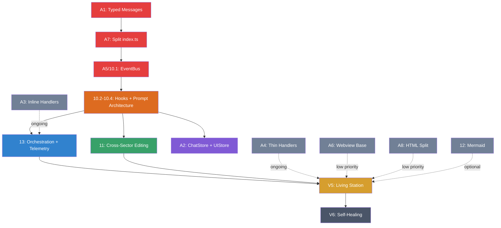

# SpaceCode Architecture Alignment Roadmap

**Status**: Active
**Purpose**: Single authoritative plan for architecture alignment + V4 + V5 + self-healing modularity
**Scope**: Order of execution, dependencies, and specific gaps
**Revision**: v2 — interleaved execution (alignment gates + V4 features ship together)

---

## 0) Execution Philosophy

> **Ship value early. Align incrementally.**

The original plan gated all V4 work behind a complete Phase A rewrite. In practice, only 3 alignment items are hard prerequisites for V4's core value (EventBus + Hooks + Prompt Architecture). The rest can happen alongside or after V4 features ship.

**Execution order:**
```
Critical Alignment (A1, A7, A5)
  → V4 Core (EventBus + HookPipeline + Prompt Architecture)
    → Stores (A2)
      → V4 Features (Cross-Sector, Orchestration)
        → Incremental Cleanup (A3, A4, A6, A8) — ongoing
          → V5 (Living Station)
            → V6 (Self-Healing)
```

**Rationale:**
- A1 (typed messages) is needed so V4 signals have a schema to follow.
- A7 (split index.ts) is needed so V4 feature modules can be wired cleanly.
- A5 (EventBus) is literally V4 Phase 10.1 — do it once, not twice.
- Everything else (inline handlers, domain engine extraction, HTML split) can happen incrementally without blocking V4 value delivery.

---

## Phase A — Architecture Alignment

**Goal**: Make the current code conform to `docs/ARCHITECTURE_OVERVIEW.md`.

### Critical Prerequisites (must complete before V4 core)

#### A1. Typed Message Schema
**Why**: UI ↔ backend is currently ad-hoc strings. V4 signals and hooks need a typed contract.
**Priority**: Gate — blocks V4 Phase 10
**Tasks**
- [ ] Create `src/shared/messageTypes.ts` (request/response/event types)
- [ ] Add `version: number` field to base message type (start at `1`; allows future schema migration without breaking existing handlers)
- [ ] Enforce in `src/webview/panel/ipc/messageRouter.ts`
- [ ] Enforce in `src/mastercode_port/ui/mainPanelRouter.ts`
- [ ] Enforce in all `src/mastercode_port/ui/handlers/*`

**Acceptance checks:**
- [ ] `messageTypes.ts` exports ≥ 1 request/response/event type per handler file
- [ ] `messageRouter.ts` uses a discriminated union switch (no bare `msg.type === 'string'` literals outside the switch)
- [ ] Zero `any` in message payloads (all payloads typed)
- [ ] Base message type includes `version: number` field

#### A7. Split UI Bootstrap
**Why**: `webview/panel/index.ts` is 2,100+ lines — monolithic. V4 feature modules need clean entry points.
**Priority**: Gate — blocks clean V4 wiring
**Tasks**
- [ ] Split into `bootstrap.ts`, `ipc/router.ts`, `ipc/bridge.ts`
- [ ] Keep features under `features/*`
- [ ] Remove global `window.xxx` exports (move to feature modules)

**Acceptance checks:**
- [ ] `index.ts` < 200 lines (bootstrap + imports only)
- [ ] `ipc/router.ts` handles all inbound message dispatch
- [ ] Zero `window.xxx` assignments in `index.ts` (features self-register)

#### A5. Internal Signal Bus
**Why**: Cross-module calls are direct; V4 needs pub/sub. This IS V4 Phase 10.1 — implemented once, listed here for dependency tracking.
**Priority**: Gate — is the foundation of V4
**Tasks**
- [ ] Implement `src/events/EventBus.ts`
- [ ] Register signals for sector, comms, ops, engineer, chat
- [ ] Replace direct calls with signals where appropriate

**Acceptance checks:**
- [ ] `getEventBus()` returns singleton from any importing module
- [ ] ≥ 3 signal topics registered (sector, chat, engineer minimum)
- [ ] `publish()` + `subscribe()` round-trip works (unit test passes)

### Incremental Cleanup (alongside or after V4 features)

#### A2. Migrate ChatStore + Create UIStore
**Why**: Chat state ownership is split. `features/chatStore.ts` exists with persona/skills/subscriber pattern but lives in the wrong location. `state.ts` is a plain object with no reactivity.
**Priority**: Do after V4 core (EventBus + Hooks), before V4 Orchestration tab
**Tasks**
- [ ] Move `src/webview/panel/features/chatStore.ts` → `src/webview/panel/state/chatStore.ts` (promote, don't recreate)
- [ ] Add typed interfaces: `ChatState`, `PersonaState`, `SkillState`
- [ ] Create `src/webview/panel/state/uiStore.ts` — reactive wrapper for `uiState` with subscriber pattern
- [ ] Replace local globals in `webview/panel/index.ts` (simplified by A7 split)
- [ ] Persist via `globalState` where required

#### A3. Remove Inline Handlers
**Why**: HTML still binds logic via inline `onclick`.
**Priority**: Ongoing — fix as you touch each file, not as a big-bang pass
**Tasks**
- [ ] Remove inline handlers from `mainPanelHtml.ts`
- [ ] Bind all UI actions in `webview/panel/features/*`
- [ ] Replace `openExternalUrl` usage with routed actions

#### A4. Thin Handlers, Move Domain Logic
**Why**: `ui/impl/*` (19 files) contains core logic, violates architecture.
**Priority**: Ongoing — extract engines as V4/V5 features need them
**Note**: Some engines already follow the correct pattern — keep them as-is:
- `src/autopilot/AutopilotEngine.ts` — proper domain engine with state machine
- `src/engineer/EngineerEngine.ts` — proper engine with types, scorer, persistence
- `src/gameui/GameUIPipeline.ts` — proper domain pipeline

**Tasks**
- [ ] Create **new** domain engines for: `plans`, `skills`, `comms`, `ship`, `tickets`, `docs`, `kb`
- [ ] Move logic from `ui/impl/*` into corresponding engines
- [ ] Handlers only call engines + post results
- [ ] Goal: `ui/impl/` directory eliminated or reduced to thin message-translation stubs

#### A6. Shared Webview Base
**Why**: CSP/postMessage/HTML duplicated in multiple panels.
**Priority**: Low — do when adding new panels or during V5
**Tasks**
- [ ] Create `src/mastercode_port/ui/webviewBase.ts`
- [ ] Refactor mainPanel, sidebar, hotspotToolPanel to use it

#### A8. HTML Template Split
**Why**: `mainPanelHtml.ts` is too large.
**Priority**: Low — do alongside A3 (inline handler removal)
**Tasks**
- [ ] Split into sections (layout, panels, templates)

### Phase A Exit Criteria

**Gate criteria (must be true before V4 core starts):**
- [ ] **A1**: Typed messages schema exists (`src/shared/messageTypes.ts`) — see A1 acceptance checks
- [ ] **A7**: `index.ts` split into bootstrap + router + bridge — see A7 acceptance checks
- [ ] **A5**: EventBus implemented and singleton accessible — see A5 acceptance checks
- [ ] All gate acceptance checks pass (each gate's checks are individually verifiable)

**Ongoing criteria (tracked, no gate):**
- [ ] ChatStore migrated + UIStore created
- [ ] Inline `onclick` handlers progressively removed
- [ ] `ui/impl/` progressively thinned
- [ ] Webview base extracted
- [ ] HTML templates split

---

## Phase B — V4 (Signals, Hooks, Prompt Architecture)

**Goal**: Build the nervous system (Signals + Hooks + Prompt Architecture), then orchestration.
> Full spec: `docs/V4_IMPLEMENTATION_CHECKLIST.md`

### B1. EventBus + Hook Pipeline + Prompt Architecture (V4 Phase 10)
> This is the core value of V4. Phase 14 (Prompt Architecture) is merged here because the Hook Pipeline is meaningless without the prompt augmentation it enables.

- [ ] EventBus core: typed pub/sub, wildcard subscriptions, signal history buffer
- [ ] HookPipeline core: ordered middleware, register/unregister, blocking support
- [ ] Prompt augmentation hooks: sector-rules, context-items, persona-skills, engineer-context
- [ ] Token budget manager: prioritized trimming, per-hook token accounting
- [ ] Suggestion extractor hook: parse AI responses for engineer-actionable items
- [ ] Component registration: each V3 engine subscribes to relevant signals
- [ ] Refactor `chatImpl.ts` to use hook pipeline instead of hardcoded injection
- [ ] Remove `injectContext` toggle dependency — context always injected when available
> Fixes V3 Gap-1 (sector rules not reaching AI) and Gap-3 (context items not reaching AI)
> See `V4_IMPLEMENTATION_CHECKLIST.md` Phase 10 (10.1–10.5) for full spec

### B2. Cross-Sector Sequential Editing (V4 Phase 11)
- [ ] Dependency graph resolution (topological sort from sector configs + asmdef)
- [ ] Cross-sector workflow state machine
- [ ] Sector gate hook (`beforeToolExec` — blocks edits outside current sector)
- [ ] Workflow UI: banner, progress badges, skip/abort
> See `V4_IMPLEMENTATION_CHECKLIST.md` Phase 11 (11.1–11.5) for full spec

### B3. Orchestration Tab + Telemetry (V4 Phase 13)
> Merges Agents + Skills into Orchestration. Telemetry **fully replaces** the old Flow panel.

- [ ] Rename "Agents" tab → "Orchestration"
- [ ] Sub-tabs: `[Agents] [Skills] [Hooks] [Telemetry]`
- [ ] Remove standalone "Skills" tab (3 top-level tabs: Station, Orchestration, Dashboard + persistent Chat)
- [ ] Telemetry panel: signal log first (scrolling real-time log), system graph later
- [ ] **Remove Flow panel entirely** — Telemetry supersedes it with richer signal-level visibility
- [ ] Hook pipeline order view: draggable cards showing execution order per event
- [ ] Visual hook editor: event trigger → condition → action
- [ ] Skill-hook integration: YAML skills declare signal subscriptions
> Note: Build Telemetry as a signal log first (immediately useful for debugging). Animated system graph comes later.
> See `V4_IMPLEMENTATION_CHECKLIST.md` Phase 13 (13.1–13.5) for full spec

### B4. Mermaid Diagram Integration (V4 Phase 12) — Optional
> Deprioritized. Nice-to-have visualization, not on the critical path.

- [ ] Auto-generated sector dependency diagram
- [ ] User-authored Mermaid in markdown (via Phase 9 editor)
- [ ] Diagram interaction (click node → navigate)
> See `V4_IMPLEMENTATION_CHECKLIST.md` Phase 12 (12.1–12.4) for full spec
> Ship whenever time permits — does not block V5.

### Phase B Exit Criteria
- [ ] EventBus + Hook Pipeline running with built-in hooks
- [ ] Prompt augmentation active (sector rules + context always reach AI)
- [ ] Token budget manager preventing context overflow
- [ ] Cross-sector workflow enforced when active
- [ ] Orchestration tab live with Agents + Skills + Hooks + Telemetry sub-tabs
- [ ] Flow panel removed — Telemetry is the single visualization
- [ ] Old standalone Skills tab removed

---

## Phase C — V5 (Living Station)

**Goal**: CC-1 Station AI, autonomy, system intelligence, and external tool integration.
> Full spec: `docs/V5_IMPLEMENTATION_CHECKLIST.md` (Phases 15–19)

### C0. CC-1 & First Contact (V5 Phase 15)
- [ ] CC-1 identity integration (AgentId, PERSONA_MAP, system prompt, specialist routing)
- [ ] First Contact onboarding wizard (start with 4 core steps: callsign → mission type → engine detection → readiness report; remaining steps become Guardian nags)
- [ ] Migration path for existing V3/V4 projects (`.spacecode/` exists but no `station.json`)
> Full spec: V5 Phase 15

### C1. Guardian & Safety Layer (V5 Phase 16)
- [ ] Start with DocGuardian (highest user value, simplest detection)
- [ ] Then FolderGuardian, EngineGuardian
- [ ] MissionGuardian last (weekly summaries, inactivity — nice-to-have)
- [ ] Station Readiness Score (0–100% weighted metric)
- [ ] Progressive nag escalation + CC-1 status messages
- [ ] Guardian ↔ V4 Hook Pipeline integration (prompt injection)
- [ ] Guardian ↔ V4 Signal subscriptions (reactive monitoring)
> Full spec: V5 Phase 16 (9 subsections)

### C2. Multi-Provider Expansion (V5 Phase 17)
- [ ] Extend existing `AIProvider` interface in `providers/base.ts` (add Gemini)
- [ ] ProviderManager with `manual` and `primary-fallback` strategies (ship these first)
- [ ] `round-robin` and `smart` routing strategies later if users want them
- [ ] Refactor existing Claude/GPT providers to extended interface
> Full spec: V5 Phase 17

### C3. Voice Interface (V5 Phase 18)
- [ ] Extend existing `VoiceService` with cloud STT/TTS providers
- [ ] Push-to-talk UX, persona-aware voice selection
- [ ] CC-1 voice personality
> Full spec: V5 Phase 18

### C4. Ralph Integration (V5 Phase 19)
- [ ] External CLI adapter (RalphRunner.ts) — SpaceCode launches Ralph, tracks progress, ingests outputs
- [ ] Control panel UI, signal integration, Guardian triggers
> Full spec: V5 Phase 19

**Exit Criteria (Phase C complete)**
- CC-1 is default chat persona with specialist routing
- First Contact onboarding functional
- Guardian gating active with readiness scoring
- Multi-provider stable with Gemini support
- Voice layer stable (STT + TTS)
- Ralph adapter operational

---

## Phase D — V6 (Self-Healing Modularity)

**Goal**: SpaceCode can analyze its own codebase and self-heal alignment.
> Prerequisite: Phases A–C complete. Depends on stable architecture model to measure drift against.
> **Awareness only — don't design for this yet.**

### D1. SA Inference Engine
- [ ] TS/Node SA module spec + rules
- [ ] Layer inference from folder and import graph
- [ ] Architecture drift detection

### D2. Self-Healing Workflow
- [ ] Proposed refactor plan generation
- [ ] Autoexecute-guarded remediation
- [ ] Diff + test gate before apply
- [ ] Fallback: if no test coverage → require manual approval (no auto-apply)

### D3. Modular Specializations
- [ ] Unity SA module (existing)
- [ ] TS/Node SA module (new)
- [ ] Linux/Ops module (optional)
- [ ] WordPress module (optional)

**Exit Criteria (Phase D complete)**
- SA inference produces actionable plan
- Self-heal requires approval + passes tests
- Multiple SA modules supported

---

## Concrete Execution Order

This is the day-to-day sequence. Each step produces shippable, testable output.

| Step | Item | What Ships | Blocks |
|------|------|-----------|--------|
| 1 | **A1**: Typed message schema | `src/shared/messageTypes.ts`, enforced in routers/handlers | Step 3 |
| 2 | **A7**: Split index.ts | `bootstrap.ts`, `ipc/router.ts`, `ipc/bridge.ts` | Step 3 |
| 3 | **A5 + 10.1**: EventBus | `src/events/EventBus.ts`, signal catalog, singleton | Step 4 |
| 4 | **10.2**: Hook Pipeline | `src/hooks/HookPipeline.ts`, register/unregister/run | Step 5 |
| 5 | **10.3 + 14**: Prompt augmentation + token budget | Built-in hooks, token budget manager, chatImpl refactor | Step 6 |
| 6 | **10.4**: Component registration | Each V3 engine wired to EventBus | — |
| 7 | **A2**: ChatStore + UIStore | `state/chatStore.ts`, `state/uiStore.ts`, reactive wrappers | — |
| 8 | **11**: Cross-sector editing | DependencyGraph, CrossSectorWorkflow, sector gate hook | — |
| 9 | **13**: Orchestration + Telemetry | Tab merge, signal log, hook editor, Flow panel removed | — |
| 10 | **12**: Mermaid (optional) | Diagram generators, interactive diagrams | — |
| — | **A3/A4/A6/A8** | Incremental cleanup | Ongoing |

**After V4:**

| Step | Item | What Ships |
|------|------|-----------|
| 11 | **15**: First Contact (slim) | CC-1 identity, 4-step onboarding, station.json |
| 12 | **16**: Guardian (DocGuardian first) | Proactive monitoring, readiness score |
| 13 | **17**: Multi-provider (manual + fallback) | Gemini provider, ProviderManager |
| 14 | **18**: Voice | Cloud STT/TTS, push-to-talk |
| 15 | **19**: Ralph adapter | External CLI integration |

---

## What's Lacking Today (Concrete Gaps)

**Critical alignment gaps (blocking V4 core):**
- No typed message schema (UI ↔ backend)
- `index.ts` still monolithic (2,100+ lines)
- No EventBus (signals)

**Non-blocking alignment gaps (fix incrementally):**
- No authoritative ChatStore / UIStore (plain object, wrong location)
- Inline HTML handlers still present
- Domain logic still inside `ui/impl/*`
- CSP/postMessage duplicated across panels
- `mainPanelHtml.ts` too large

**V3 Gaps carried into V4:**
- Gap-1: Sector rules shown in UI but never sent to AI
- Gap-2: No component-to-component communication
- Gap-3: Context items shown in UI but may not reach AI

**Self-healing prerequisites (V6, not actionable yet):**
- TS/Node SA module spec
- Architecture drift detection
- Auto-refactor engine
- Guarded execution pipeline

---

## Dependency Map



**Legend**: Red = gate prerequisites, Orange = V4 core value, Green/Blue = V4 features, Purple = alignment catch-up, Gray = ongoing/optional, Yellow = V5

---

## Links

- `docs/ARCHITECTURE_OVERVIEW.md`
- `docs/V3_IMPLEMENTATION_CHECKLIST.md`
- `docs/V4_IMPLEMENTATION_CHECKLIST.md`
- `docs/V5_IMPLEMENTATION_CHECKLIST.md`
- `docs/STATION_ENGINEER_UX_SPEC.md`

---

*Last updated: 2026-02-05*
