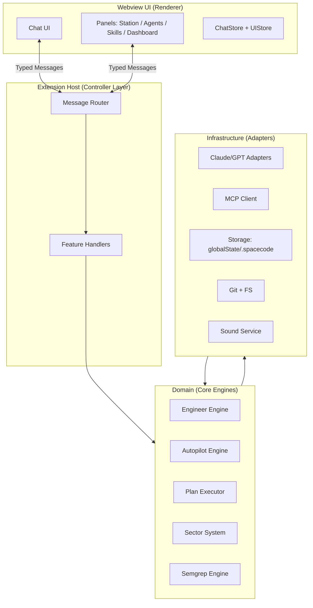
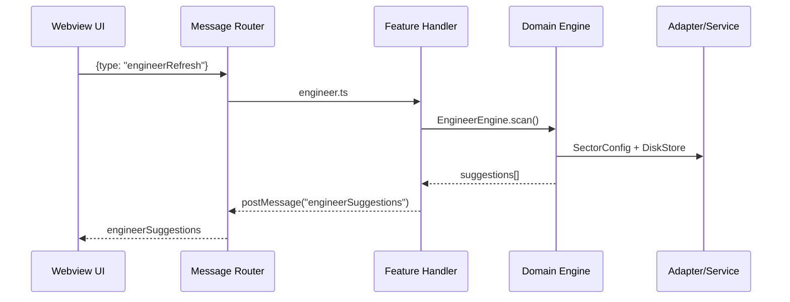
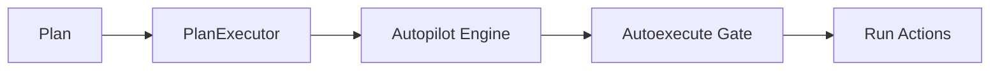

# SpaceCode Architecture Overview

**Status**: Draft (authoritative reference)  
**Scope**: Extension + webview architecture, boundaries, and message flow  
**Goal**: Maintainability, modularity, and safe iteration for V3+ features

---

## 1) Architecture Summary

**Pattern**: Modular monolith with ports/adapters + typed message bus  
**Reason**: Strong boundaries without microservice overhead.

**Key principles**
- UI is **pure rendering + state**; it never touches filesystem or services directly.
- Extension host owns **routing + orchestration** only.
- Domain engines are **pure feature logic** and are isolated behind interfaces.
- Infrastructure provides **adapters** to external systems (LLMs, CLI tools, MCP, disk).

---

## 2) Layered Architecture



---

## 3) Message Protocol (UI ↔ Extension)

All UI ↔ extension communication uses a **typed message schema**.



**Rules**
- No direct service calls in UI.
- Message types are centralized and versioned.
- Handlers contain **zero business logic**.

---

## 4) Feature Slice Structure

Each feature is a vertical slice across layers:

```
webview/panel/features/<feature>.ts   (UI logic)
ui/handlers/<feature>.ts             (message handling)
<feature>/<Feature>Engine.ts         (domain logic)
<feature>/<Feature>Persistence.ts    (optional)
```

Example:
```
engineer/
  EngineerEngine.ts
  EngineerTypes.ts
  EngineerPersistence.ts
ui/handlers/engineer.ts
webview/panel/features/engineer.ts
```

---

## 5) State Model

**UI state**
- `ChatStore` (messages, persona, skills, overrides)
- `UIStore` (layout, panel visibility, selections)

**Backend state**
- `SettingsStore` (user settings)
- `SessionStore` (autopilot session, engineer history)
- `.spacecode/` workspace files (sectors, overrides)

---

## 6) Internal Event System

Use an internal event bus for backend modules:

```mermaid
flowchart LR
  Bus["Signal Bus"]
  SECT["Sector Watcher"] --> Bus
  SEMG["Semgrep Runner"] --> Bus
  ENG["Engineer Engine"] <-- Bus
  AUTO["Autopilot"] <-- Bus
```

**Naming**: use **signals/topics** internally (e.g., `sector:changed`).

---

## 7) Execution Control

Autopilot & autoexecute are **execution layers**, not UI:



---

## 8) Source of Truth

- **Models + pricing**: `config/models.ts`
- **Skills registry**: `skills/`
- **Sectors**: `.spacecode/sectors.json`
- **Overrides**: `.spacecode/model-overrides.json`

No duplicate definitions.

---

## 9) Architecture Constraints (Non‑Negotiable)

- UI never touches filesystem or services directly.
- Handlers never contain business logic.
- Domain code never imports webview modules.
- All new features follow the vertical‑slice structure.

---

## 10) Roadmap Fit

- **V3**: solidifies core UX + modular engines.
- **V4+**: optional provider integrations (Gemini), Ralph adapter, advanced Ops.

---

## Diagrams Source

Diagrams are in Mermaid and can be rendered in GitHub or VS Code with Mermaid preview.

