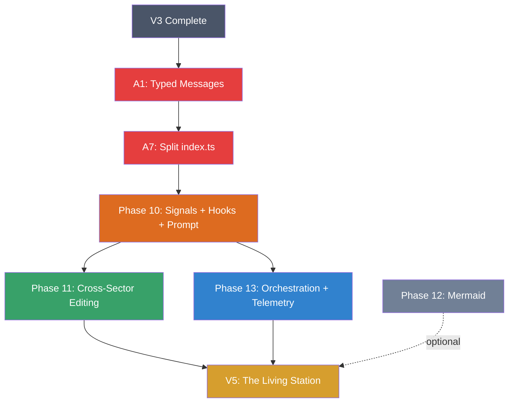

# SpaceCode V4 Implementation Checklist

**Status**: Active
**Baseline**: V3 complete, Phase A alignment gates met (A1 + A7 + A5)
**Theme**: Inter-component communication, prompt architecture, and orchestration
**Core Insight**: V3 components (Engineer, Comms, Ops, Autopilot, Personas) are isolated silos. V4 wires them together via an EventBus and Hook Pipeline — the nervous system of SpaceCode.
**Revision**: v2 — Phase 14 merged into Phase 10; Flow panel fully replaced by Telemetry; Phase 12 deprioritized

### Naming Convention

> The station metaphor guides UI labels and documentation. Code internals keep standard technical names.

| Concept | Code name (internal) | UI / Doc term | Why |
|---------|---------------------|---------------|-----|
| EventBus topics / events | `EventBus`, `publish()`, `subscribe()` | **Signals** | "Component A *signals* Component B." Natural verb + noun. Space stations communicate via signals. |
| Hook Pipeline | `HookPipeline`, `Hook` | **Hooks** | Industry-standard term. Devs already know it. Precise — covers inspect, modify, block. |
| Live Flow Monitor | `TelemetryPanel`, `liveFlowMonitor.ts` | **Telemetry** | Aerospace term: automated real-time data from remote systems. Exactly what this panel does. |

**Post-V4 tab bar**: `[Station] [Orchestration] [Dashboard]` + persistent Chat

**Orchestration sub-tabs**: `[Agents] [Skills] [Hooks] [Telemetry]`

**Vocabulary rules:**
- In UI labels, tooltips, docs: use "signal" not "event" — *"3 subscribers to this signal"*, *"signal: sector:file-changed"*
- In code: use `event`, `publish`, `subscribe` (standard EventEmitter API)
- The Telemetry panel tooltip: *"Real-time signal flow — the station's nervous system"*

---

## How to Use This Document

1. Pick a task from the checklist below
2. Mark it as `[~]` (in progress)
3. Implement, test in Extension Development Host
4. Mark as `[x]` when complete and working
5. Commit changes

**Legend:**
- `[ ]` Not started
- `[~]` In progress
- `[x]` Complete
- `[!]` Blocked / Issues

**Phase order:** 10 → 11 → 13 → 12 (optional)

---

## V3 Gaps Carried Forward

> Issues discovered during V3 execution that V4 addresses

### Gap-1: Sector Rules Not Injected Into Prompts
> **Critical**: Sector rules are visualized in the AI flow UI but NEVER sent to the AI.
> The AI doesn't know about sector constraints unless the user manually toggles "Inject Context".

- [ ] Sector rules must be injected into the system prompt automatically when a sector is active
- [ ] Remove dependency on manual `injectContext` toggle for sector rules
- [ ] Sector rules go into system prompt (not user message) to avoid token waste on repetition

### Gap-2: No Component-to-Component Communication
> Components only talk to the webview via `postMessage()`. Engineer can't notify Comms. Ops can't feed Engineer. Chat can't push suggestions back.

- [ ] Addressed by Phase 10 (EventBus)

### Gap-3: Context Items Not Reaching AI
> Like sector rules, gathered context items (KB chunks, doc snippets) are shown in flow visualization but may not reach the actual prompt depending on toggle state.

- [ ] Context items should always be injected when gathered (that's the whole point of gathering)
- [ ] Telemetry should reflect what actually reaches the AI, not be a separate display

---

## Phase 10: EventBus, Hook Pipeline & Prompt Architecture (Signals, Hooks & Prompt)
> The nervous system — enables all components to communicate without direct coupling
> **Must be implemented before Phases 11–13** as they depend on EventBus
> **Includes former Phase 14** (Prompt Architecture) — merged because the Hook Pipeline is meaningless without the prompt augmentation it enables
> **UI terminology**: EventBus topics = Signals, Hook Pipeline = Hooks, Live Flow Monitor = Telemetry

### 10.0 Concept

```
┌─────────────────────────────────────────────────────────────┐
│                      EVENT BUS                               │
│                                                              │
│  signal('sector:file-changed') ──→ [subscribers...]          │
│  signal('comms:scan-complete') ──→ [subscribers...]          │
│  signal('ops:alert')           ──→ [subscribers...]          │
│  signal('chat:response-ready') ──→ [subscribers...]          │
│  signal('engineer:suggestion')  ──→ [subscribers...]          │
│                                                              │
│  Any component sends signals. Any component listens.         │
│  No component needs to know who's listening.                 │
└─────────────────────────────────────────────────────────────┘

┌─────────────────────────────────────────────────────────────┐
│                     HOOK PIPELINE                            │
│                                                              │
│  beforeAiCall ──→ [sector-rules] → [context-items] → [kb]   │
│  afterAiResponse ──→ [suggestion-extractor] → [finding-fmt]  │
│  beforeToolExec ──→ [sector-gate] → [approval-check]         │
│  onSectorChange ──→ [notify-dependents] → [update-engineer]  │
│                                                              │
│  Ordered middleware. Each hook can inject, modify, or block.  │
└─────────────────────────────────────────────────────────────┘
```

**EventBus vs Hook Pipeline:**
| Aspect | EventBus | Hook Pipeline |
|--------|----------|---------------|
| Pattern | Pub/Sub — fire and forget | Middleware chain — ordered, can block |
| UI name | **Signals** | **Hooks** |
| Use case | Notifications, state changes | Prompt augmentation, gating, validation |
| Example | "A file changed in CORE sector" | "Before AI call, inject sector rules" |
| Blocking | No — all subscribers run | Yes — any hook can block the chain |

### 10.1 EventBus Core

- [ ] Create `src/events/EventBus.ts` — typed pub/sub singleton
- [ ] Define `SpaceCodeSignal` interface: `{ topic: string, data: any, source: string, timestamp: number }`
- [ ] Implement `publish(topic, data)` — broadcast signal to all subscribers
- [ ] Implement `subscribe(topic, handler)` — returns unsubscribe function
- [ ] Implement `subscribeOnce(topic, handler)` — auto-unsubscribe after first fire
- [ ] Wildcard subscriptions: `subscribe('sector:*', handler)` for all sector signals
- [ ] Signal history buffer (last 100 signals) for Telemetry panel
- [ ] Export `getEventBus()` singleton accessor

**Signal Catalog:**

| Signal | Payload | Publishers | Subscribers |
|-------|---------|-----------|-------------|
| `sector:file-changed` | `{ sectorId, filePath, changeType }` | File watcher | Engineer, Comms |
| `sector:entered` | `{ sectorId, previousSectorId }` | Sector navigation | Chat (persona switch), Engineer |
| `sector:violation` | `{ sectorId, filePath, rule, message }` | Asmdef gate | Engineer, Sound |
| `comms:scan-complete` | `{ tier, findings[], target }` | Comms engine | Engineer, Chat |
| `comms:finding-critical` | `{ finding, cwe, severity }` | Comms engine | Engineer, Sound, Notifications |
| `ops:alert` | `{ serverId, alertType, metrics }` | Ops monitor | Engineer, Chat, Sound |
| `ops:deploy-complete` | `{ serverId, service, success }` | Ops deployer | Engineer, Chat, Sound |
| `engineer:suggestion-new` | `{ suggestion }` | Engineer engine | Webview, Sound |
| `engineer:suggestion-accepted` | `{ suggestionId, delegateTo }` | Engineer handler | Chat, Comms, Ops |
| `chat:response-complete` | `{ chatId, persona, response }` | Chat impl | Engineer (extract suggestions) |
| `chat:persona-switched` | `{ newPersona, previousPersona, manual }` | Chat store | Webview, Context hooks |
| `autopilot:step-complete` | `{ stepIndex, result, nextStep }` | Autopilot engine | Webview, Engineer |
| `autopilot:error` | `{ stepIndex, error, strategy }` | Autopilot engine | Webview, Sound |
| `plan:generated` | `{ planId, steps[], persona }` | Plan generator | Webview, Engineer |
| `build:result` | `{ success, errors[], warnings[] }` | Unity MCP | Engineer, Sound, Chat |
| `test:result` | `{ passed, failed, skipped, details[] }` | Test runner | Engineer, Chat |
| `doc:drift-detected` | `{ docPath, driftType, severity }` | Doc sync | Engineer, Technical Writer |
| `kb:updated` | `{ chunkCount, source }` | KB service | Chat context |

### 10.2 Hook Pipeline Core

- [ ] Create `src/hooks/HookPipeline.ts` — ordered middleware execution
- [ ] Define `Hook` interface: `{ name: string, priority: number, handler: (ctx) => ctx | null }`
- [ ] Implement `register(event, hook)` — add hook to pipeline
- [ ] Implement `unregister(event, hookName)` — remove hook
- [ ] Implement `run(event, initialContext)` — execute hooks in priority order
- [ ] Hook return `null` = block the chain (with reason)
- [ ] Hook return modified `ctx` = pass to next hook
- [ ] Hook errors caught and logged, don't break chain
- [ ] Export `getHookPipeline()` singleton accessor

**Pipeline Hooks:**

| Pipeline Hook | Trigger Point | Hooks Can... |
|----------------|---------------|-------------|
| `beforeAiCall` | chatImpl.ts before orchestrator.askSingle() | Inject context, modify prompt, block send |
| `afterAiResponse` | chatImpl.ts after response received | Extract suggestions, parse findings, modify display |
| `beforeSectorChange` | Sector navigation | Validate, warn about unsaved changes, block |
| `beforeToolExec` | Autoexecute / Autopilot step | Gate check, sector boundary validation |
| `beforePlanStep` | Autopilot before each step | Inject step-specific persona, validate preconditions |
| `afterPlanStep` | Autopilot after each step | Run tests, check quality, trigger scans |
| `beforeDelegation` | Engineer delegation to role | Load role-scoped prompt, set context |
| `onCompaction` | Before context window compaction | Save critical state, inject recovery context |

**Hook Pipeline Contract:**

```typescript
// Hook signature — every hook must conform to this interface
interface Hook {
  name: string;                      // unique identifier
  priority: number;                  // 0–999, lower = runs first
  phase: HookPhase;                  // which pipeline event this hooks into
  handler: (ctx: HookContext) => HookContext | null;  // null = block chain
}

type HookPhase =
  | 'beforeAiCall' | 'afterAiResponse' | 'beforeSectorChange'
  | 'beforeToolExec' | 'beforePlanStep' | 'afterPlanStep'
  | 'beforeDelegation' | 'onCompaction';

// Ordering guarantees:
// - Hooks execute in ascending priority order (0 before 100 before 999)
// - Equal priority: insertion order (first registered wins)
// - Built-in hooks: priority 0–99 (reserved range)
// - User hooks: priority 100–999

// Error policy:
// - Hook throws → error logged, hook skipped, chain continues
// - Hook returns null → chain blocked, reason logged, caller decides fallback
// - Hook modifies ctx → modified ctx passed to next hook
// - Timeout: individual hook execution capped at 500ms (configurable)
```

### 10.3 Prompt Augmentation Pipeline (formerly Phase 14)
> Fix Gap-1 and Gap-3: make sector rules and context items actually reach the AI

**Current flow (broken):**
```
User message → [manual toggle?] → maybe inject context → AI call
                    ↑ sector rules shown in UI but NOT sent to AI
```

**New flow (via Hook Pipeline):**
```
User message
  → beforeAiCall pipeline:
    → [sector-rules-hook]     Injects active sector rules into system prompt
    → [context-items-hook]    Injects gathered KB/doc context
    → [persona-skills-hook]   Injects active skill definitions
    → [engineer-context-hook] Injects active suggestions/warnings
    → [history-summary-hook]  Injects compaction summary if exists
  → orchestrator.askSingle(enriched prompt)
  → afterAiResponse pipeline:
    → [suggestion-extractor]  Parses AI response for engineer-actionable items
    → [finding-formatter]     Detects security findings, routes to Comms
    → [doc-drift-detector]    Detects documentation references that may be stale
```

**New Prompt Architecture:**

```
System prompt (via Hook Pipeline 'beforeAiCall'):
  1. Workspace context (path, project type)
  2. Persona prompt (role-specific .system.md)
  3. Model identity
  4. [HOOK: sector-rules]     Active sector rules & constraints
  5. [HOOK: skill-context]    Active skill definitions
  6. [HOOK: engineer-context]  Current warnings/suggestions summary
  7. [HOOK: plan-context]      Active plan step (if autopilot running)

User message:
  8. Gathered context (KB chunks, doc snippets) — ALWAYS injected when available
  9. Editor selection (when included)
  10. Original user message

Message history:
  11. Compaction summary (if compacted)
  12. Recent conversation messages

Post-response (via Hook Pipeline 'afterAiResponse'):
  13. [HOOK: suggestion-extractor]  Parse for engineer suggestions
  14. [HOOK: finding-detector]      Detect security findings
  15. [HOOK: doc-drift-checker]     Check doc references
```

- [ ] Create `src/hooks/builtins/sectorRulesHook.ts` — always injects active sector rules
- [ ] Create `src/hooks/builtins/contextItemsHook.ts` — injects gathered context
- [ ] Create `src/hooks/builtins/personaSkillsHook.ts` — injects skill definitions
- [ ] Create `src/hooks/builtins/engineerContextHook.ts` — injects active warnings
- [ ] Create `src/hooks/builtins/suggestionExtractorHook.ts` — parses response for suggestions
- [ ] Refactor `chatImpl.ts` to use `hookPipeline.run('beforeAiCall', ctx)` instead of hardcoded injection
- [ ] Remove `injectContext` toggle dependency — context is always injected when available
- [ ] Document prompt architecture in `src/hooks/PROMPT_ARCHITECTURE.md` (developer reference)
- [ ] Each numbered item has a corresponding hook with clear priority

### 10.4 Token Budget Manager

- [ ] Create `src/hooks/TokenBudgetManager.ts`
- [ ] Input: total context window, each hook's content
- [ ] Prioritized trimming: if total exceeds budget, trim from lowest priority up
- [ ] Priority order (highest to lowest): persona > sector rules > user message > history > context items > engineer warnings > skill defs
- [ ] Report what was trimmed in Telemetry: "sector-rules: +340 tokens", "engineer-ctx: trimmed (budget)"
- [ ] Token budget allocation: system prompt ≤ 20%, context ≤ 30%, history ≤ 40%, user ≤ 10%
- [ ] When budget exceeded: drop lowest-priority hooks first (engineer-context before sector-rules)
- [ ] User can adjust priority in Settings

### 10.5 Component Registration
> Each V3 component registers its signal subscriptions and hooks at activation

- [ ] `src/engineer/EngineerEngine.ts` → subscribe to `sector:*`, `comms:*`, `ops:*`, `build:*`, `test:*` signals
- [ ] `src/mastercode_port/ui/impl/chatImpl.ts` → register `beforeAiCall` / `afterAiResponse` hooks
- [ ] `src/security/CommsEngine.ts` → subscribe to `engineer:suggestion-accepted` signal (when type = scan)
- [ ] `src/ops/OpsEngine.ts` → subscribe to `engineer:suggestion-accepted` signal (when type = deploy/harden)
- [ ] `src/planning/PlanExecutor.ts` → register `beforePlanStep` / `afterPlanStep` hooks
- [ ] `src/sectors/SectorManager.ts` → emit `sector:*` signals on file changes
- [ ] Create `src/hooks/HookRegistry.ts` — central registration, runs at extension activation

---

## Phase 11: Cross-Sector Sequential Editing
> When a change spans multiple sectors, guide the developer through them in dependency order

### 11.0 Concept

```
Problem: Bug fix requires changes in CORE, UI, and COMBAT sectors.
         Editing all three simultaneously breaks sector isolation.

Solution: Sequential sector workflow guided by dependency graph.

┌─────────────────────────────────────────────────────────┐
│  CROSS-SECTOR WORKFLOW                                   │
│                                                          │
│  Step 1: CORE sector (dependency root)                   │
│    → Edit files, run sector tests                        │
│    → Commit: "fix(core): update shared interface"        │
│    → ✅ CORE complete                                    │
│                                                          │
│  Step 2: UI sector (depends on CORE)                     │
│    → Edit files, run sector tests                        │
│    → Commit: "fix(ui): adapt to new interface"           │
│    → ✅ UI complete                                      │
│                                                          │
│  Step 3: COMBAT sector (depends on CORE)                 │
│    → Edit files, run sector tests                        │
│    → Commit: "fix(combat): adapt to new interface"       │
│    → ✅ COMBAT complete                                  │
│                                                          │
│  Final: Run cross-sector integration tests               │
│         Merge commits or squash                          │
└─────────────────────────────────────────────────────────┘
```

### 11.1 Dependency Graph Resolution

- [ ] Create `src/sectors/DependencyGraph.ts` — build directed graph from sector configs + asmdef refs
- [ ] `getEditOrder(affectedSectors[])` → returns topologically sorted list (upstream first)
- [ ] Detect circular dependencies → warn, allow manual override
- [ ] Visualize order in UI: numbered badges on sector cards

### 11.2 Cross-Sector Workflow Engine

- [ ] Create `src/sectors/CrossSectorWorkflow.ts` — state machine for multi-sector edits
- [ ] States: `idle` → `planning` → `editing(sectorId)` → `testing` → `committing` → `next` → `complete`
- [ ] On workflow start: analyze affected files → determine sectors → resolve order
- [ ] Lock current sector context — AI prompt includes ONLY this sector's rules
- [ ] On sector complete: run sector-scoped tests, prompt commit, advance to next
- [ ] On workflow complete: run integration tests across all affected sectors

### 11.3 Sector Gate (Hook)

- [ ] Create `src/hooks/builtins/sectorGateHook.ts` — `beforeToolExec` hook
- [ ] When a cross-sector workflow is active:
  - Allow edits ONLY to files in the current sector
  - Block edits to files in other sectors with message: "Complete {currentSector} first. Next: {nextSector}"
  - Allow read-only access to all sectors (for reference)
- [ ] When NO workflow active: sector gate is advisory only (warn, don't block)
- [ ] **Fallback when no custom sectors configured**: gating fully disabled — warn-only mode with status bar message "Sector gating inactive — configure sectors in Station → Sectors to enable"
- [ ] Gate respects manual override: user can force-edit with confirmation
- [ ] Emit `sector:violation` signal when blocked → Engineer picks it up

### 11.4 Cross-Sector UI

- [ ] Workflow banner in Station tab: "Cross-Sector Edit: Step 2/3 — UI Sector"
- [ ] Progress indicator: sector badges with checkmarks
- [ ] "Skip Sector" button (if sector has no actual changes needed)
- [ ] "Abort Workflow" button (returns to free editing)
- [ ] Integration with Engineer: suggestions scoped to current workflow step

### 11.5 Cross-Sector Notification

- [ ] When completing a sector step, emit `sector:step-complete` signal
- [ ] Dependent sectors get notified: "CORE changes complete — UI sector ready for editing"
- [ ] Engineer generates suggestions for next sector based on changes made in previous
- [ ] Sound event: `sectorStepComplete`

---

## Phase 13: Orchestration Tab + Telemetry
> Consolidate Agents + Skills + Hooks + Telemetry into one unified tab
> Telemetry **fully replaces** the old Flow panel — no simplified view needed

### 13.0 Concept

```
┌─ ORCHESTRATION TAB ─────────────────────────────────────────┐
│                                                              │
│  [Agents]  [Skills]  [Hooks]  [Telemetry]                    │
│                                                              │
│  ┌─ AGENTS ─────────────────────────────────────────────┐   │
│  │  Drawflow canvas (existing V3)                        │   │
│  │  Node types: Agent, Skill, Hook, Gate, Condition      │   │
│  │  Wires = signals (EventBus topics)                     │   │
│  │  New: Hook nodes that fire on signals                 │   │
│  └───────────────────────────────────────────────────────┘   │
│                                                              │
│  ┌─ SKILLS ─────────────────────────────────────────────┐   │
│  │  YAML skill cards (existing V3)                       │   │
│  │  New: Skills can declare signal subscriptions           │   │
│  │  New: Skills can emit signals                          │   │
│  └───────────────────────────────────────────────────────┘   │
│                                                              │
│  ┌─ HOOKS ──────────────────────────────────────────────┐   │
│  │  Visual hook editor                                   │   │
│  │  [Event] ──→ [Condition] ──→ [Action]                 │   │
│  │                                                        │   │
│  │  Like Blueprint nodes or IFTTT recipes                │   │
│  │                                                        │   │
│  │  Registered hooks list with enable/disable toggles    │   │
│  │  Built-in hooks (greyed out, always active)           │   │
│  │  User hooks (editable, can be disabled)               │   │
│  └───────────────────────────────────────────────────────┘   │
│                                                              │
└──────────────────────────────────────────────────────────────┘
```

### 13.1 Tab Restructure

- [ ] Rename "Agents" tab → "Orchestration" in header
- [ ] Keep existing Agents Drawflow canvas as first sub-tab
- [ ] Add "Skills" sub-tab (move from standalone tab)
- [ ] Add "Hooks" sub-tab (new)
- [ ] Add "Telemetry" sub-tab (new — **fully replaces** old Flow panel)
- [ ] Remove standalone "Skills" tab from header (3 tabs: Station, Orchestration, Dashboard + persistent Chat)
- [ ] **Remove Flow panel** — full deprecation checklist:
  - [ ] Remove `'flow'` from `TAB_PANEL_MODES` in `state.ts` (both CHAT and STATION entries)
  - [ ] Remove `'flow'` from `TAB_DEFAULT_MODE` if present
  - [ ] Remove Flow-related buttons (`panelModeFlow`, any `data-mode="flow"`) from `mainPanelHtml.ts`
  - [ ] Delete `src/webview/panel/features/flow.ts` (or empty to no-op stub if other modules import it)
  - [ ] Remove `initContextFlowVisualization()` call from `index.ts` / `bootstrap.ts`
  - [ ] Remove Flow-related CSS classes from `panel.css` (`.flow-*`, `#contextFlowCanvas`, etc.)
  - [ ] Remove Flow-related message types from `messageRouter.ts` (`contextFlowData`, `flowUpdate`, etc.)
  - [ ] Remove any D3 flow visualization imports/dependencies
  - [ ] Search codebase for remaining `flow` references: `grep -r "flow" src/webview/ media/` — remove or rename as needed
  - [ ] Verify: `npm run build` succeeds with zero Flow references in output

### 13.2 Drawflow Enhancement

- [ ] New node type: **Hook Node** — subscribes to signal, fires connected workflow
- [ ] New node type: **Gate Node** — conditional check (if sector = X, if autoexecute = ON, etc.)
- [ ] New node type: **Signal Emitter** — emits signal as output
- [ ] Wires between nodes = data flow (output of one → input of next)
- [ ] Visual: Hook nodes have lightning bolt icon, Gate nodes have diamond shape
- [ ] Drawflow workflows can be triggered BY signals (not just manual start)

### 13.3 Visual Hook Editor

- [ ] Create `src/webview/panel/features/hookEditor.ts`
- [ ] Three-column layout: [Event Trigger] → [Condition] → [Action]
- [ ] Signal trigger dropdown: all signal topics
- [ ] Condition builder: simple rules (sector == 'core', severity == 'high', etc.)
- [ ] Action dropdown: inject context, send notification, trigger scan, delegate to persona, emit signal
- [ ] "Add Hook" button creates new row
- [ ] Toggle switch per hook (enable/disable)
- [ ] Built-in hooks shown with lock icon (read-only, always enabled)
- [ ] User hooks are editable and can be deleted
- [ ] Hooks saved to `.spacecode/hooks.json`

### 13.4 Skill-Hook Integration

- [ ] YAML skill front-matter can declare: `subscribes: ['sector:file-changed']`
- [ ] When skill is active and subscribed signal fires → skill auto-activates in chat context
- [ ] YAML skill front-matter can declare: `publishes: ['skill:analysis-complete']`
- [ ] After skill runs → emits signal via EventBus
- [ ] This makes skills composable: skill A's output triggers skill B

### 13.5 Telemetry Panel (replaces Flow panel)
> Real-time visualization of signal flow and hook execution
> **Fully replaces** the old Station Flow panel (Fate Web D3 visualization)
> Lives in: Orchestration tab as 4th sub-tab `[Agents] [Skills] [Hooks] [Telemetry]`
> Tooltip: *"Real-time signal flow — the station's nervous system"*

**Why Telemetry replaces Flow:**
The old Flow panel showed a decorative query→model→response animation. It was a visualization of an idealized flow, not what actually happened. Telemetry shows the real signal and hook activity — what was injected, what was trimmed, what blocked, and how long each step took. It's strictly more useful.

**Three panels:**

**A. System Graph (top)** — Canvas showing all components as nodes and signal subscriptions as edges.

- [ ] Create `src/webview/panel/features/telemetryPanel.ts`
- [ ] Render components as nodes: Sector Watcher, Engineer Engine, Chat, Comms, Ops, Autopilot, Hook Pipeline, AI Provider
- [ ] Render signal subscriptions as directed edges between nodes
- [ ] **Animation**: When a signal fires, the edge between publisher → subscriber pulses with a traveling dot
- [ ] Node glow: publisher node flashes on emit, subscriber nodes flash on receive
- [ ] Color coding: green = success, amber = processing, red = error/blocked
- [ ] Hook Pipeline node expands to show individual hooks in sequence when active
- [ ] Click any node → tooltip with stats (signals emitted, signals received, avg latency)
- [ ] Click any edge → show recent signals that traveled this path
> **Build order**: Signal log (panel B) first — immediately useful for debugging. System graph comes second when there's real data to visualize.

**MVP scope (ship first):**
- Signal log (panel B) — scrolling real-time log with filters and payload expansion
- Hook execution counters — per-hook call count, avg latency, block count
- Token contribution per hook — "sector-rules: +340 tokens"
- **Explicitly deferred to post-MVP**: System graph canvas (panel A), traveling dot animations, node glow effects, SVG/CSS edge animations. Build these only after the signal log proves useful with real data.

**B. Signal Log (middle)** — Scrolling real-time log of all signal activity.

- [ ] Subscribe to ALL signals via wildcard: `eventBus.subscribe('*', logHandler)`
- [ ] Each row: timestamp, signal topic, payload summary, subscriber count, execution time
- [ ] Color-coded by signal category (sector = blue, comms = red, chat = green, etc.)
- [ ] Filter dropdown: show all / sector only / hooks only / errors only
- [ ] Click row → expand to show full payload JSON
- [ ] Pause button to freeze the log (signals still fire, just stop scrolling)
- [ ] "Clear" button to reset log
- [ ] Max 500 entries, oldest auto-removed
- [ ] **Show prompt augmentation detail**: when `beforeAiCall` runs, log each hook's contribution with token count ("sector-rules: +340 tokens", "context-items: +520 tokens", "engineer-ctx: trimmed to 0")

**C. Hook Pipeline Order (bottom)** — Draggable list showing hook execution order per pipeline event.

- [ ] Show all hooks registered for the selected pipeline event (dropdown: beforeAiCall, afterAiResponse, etc.)
- [ ] Each hook as a draggable card with grip handle (`≡`)
- [ ] **Drag to reorder** = change hook priority (saved to `.spacecode/hooks.json`)
- [ ] Card shows: hook name, source (built-in / user), last execution time, token impact
- [ ] Toggle switch on each card: enable/disable (built-in hooks can be disabled but show warning)
- [ ] `[+ Add Hook]` button at end of pipeline → opens hook creator
- [ ] When a hook executes, its card briefly highlights (green flash = pass, red = block)
- [ ] Show token count each hook contributed: "sector-rules: +340 tokens"

**Animation implementation:**

- [ ] Use CSS animations for node glow: `@keyframes pulse { 0% { box-shadow: 0 0 0 rgba(...) } ... }`
- [ ] Use SVG `<animate>` or CSS `offset-path` for traveling dots along edges
- [ ] EventBus forwards signals to webview via `postMessage({ type: 'telemetrySignal', ... })`
- [ ] Webview debounces animations at 60fps max (batch rapid signals)
- [ ] Performance: canvas only renders when Orchestration → Telemetry tab is visible
- [ ] Dark theme: nodes are dark with bright edge pulses (neon wire aesthetic)

---

## Phase 12: Mermaid Diagram Integration — Optional
> Architecture visualization within SpaceCode using Mermaid diagrams
> **Deprioritized** — nice-to-have, not on the critical path, does not block V5
> Connects to V3 Phase 9 (Live Markdown Editor) — Mermaid blocks render inline

### 12.0 Concept

Mermaid diagrams serve two purposes:
1. **Auto-generated**: SpaceCode analyzes codebase and generates architecture diagrams
2. **User-authored**: Users write Mermaid in markdown docs, rendered inline via Phase 9 editor

### 12.1 Auto-Generated Diagrams

**Where they appear and what they show:**

| Location | Diagram Type | What It Shows |
|----------|-------------|---------------|
| Station → Sectors | `graph TD` | Sector dependency graph with health badges |
| Orchestration → Telemetry | `graph LR` | Active context flow (what's injected into AI) |
| Dashboard → Docs | `graph TD` | Document relationship map (GDD → SA → TDD) |
| Dashboard → Mission | `gantt` | Project milestones and phase progress |
| Dashboard → DB | `erDiagram` | Database schema entity-relationship |
| Orchestration → Agents | `graph LR` | Agent workflow (already Drawflow, but exportable) |
| Orchestration → Hooks | `graph LR` | Hook pipeline visualization |

- [ ] Create `src/diagrams/MermaidGenerator.ts` — generates Mermaid syntax from data
- [ ] Create `src/diagrams/generators/sectorGraph.ts` — sector dependency diagram
- [ ] Create `src/diagrams/generators/contextFlow.ts` — AI context injection flow
- [ ] Create `src/diagrams/generators/docMap.ts` — document relationship map
- [ ] Create `src/diagrams/generators/dbSchema.ts` — ER diagram from schema
- [ ] Create `src/diagrams/generators/hookPipeline.ts` — hook chain visualization
- [ ] Diagrams regenerate on relevant signals via EventBus subscriptions
- [ ] Render in webview using `mermaid.js`

### 12.2 User-Authored Diagrams (via Phase 9 Markdown Editor)

- [ ] Mermaid code blocks in `.md` files render as diagrams in the Milkdown editor
- [ ] Click diagram to edit source (Obsidian-style inline editing)
- [ ] Syntax highlighting for Mermaid code blocks
- [ ] Diagram export: SVG, PNG (right-click menu)
- [ ] Live preview as user types Mermaid syntax

### 12.3 Architecture Documentation Template

- [ ] Create `.spacecode/templates/architecture.md` template with Mermaid placeholders
- [ ] Sections: System Overview, Sector Map, Data Flow, API Surface, Dependency Graph
- [ ] `/architecture` chat command generates the doc by filling Mermaid blocks from codebase analysis
- [ ] Auto-refresh diagrams when codebase changes (via `sector:file-changed` signal)

### 12.4 Diagram Interaction

- [ ] Click a sector node in the diagram → navigate to that sector in Station
- [ ] Click a document node → open that doc in the editor
- [ ] Click a DB entity → show schema details in DB panel
- [ ] Hover any node → tooltip with key stats (file count, health score, last modified)

---

## Appendix A: File Map

| Component | File(s) |
|-----------|---------|
| EventBus | `src/events/EventBus.ts` |
| Hook Pipeline | `src/hooks/HookPipeline.ts` |
| Hook Registry | `src/hooks/HookRegistry.ts` |
| Built-in Hooks | `src/hooks/builtins/*.ts` |
| Token Budget | `src/hooks/TokenBudgetManager.ts` |
| Prompt Architecture Doc | `src/hooks/PROMPT_ARCHITECTURE.md` |
| Dependency Graph | `src/sectors/DependencyGraph.ts` |
| Cross-Sector Workflow | `src/sectors/CrossSectorWorkflow.ts` |
| Sector Gate Hook | `src/hooks/builtins/sectorGateHook.ts` |
| Mermaid Generator | `src/diagrams/MermaidGenerator.ts` |
| Diagram Generators | `src/diagrams/generators/*.ts` |
| Hook Editor UI | `src/webview/panel/features/hookEditor.ts` |
| Telemetry Panel | `src/webview/panel/features/telemetryPanel.ts` |
| User Hook Config | `.spacecode/hooks.json` |

## Appendix B: Signal Reference (EventBus Topics)

```
sector:file-changed        sector:entered              sector:violation
sector:step-complete        sector:workflow-started      sector:workflow-complete
comms:scan-complete         comms:finding-critical       comms:scan-started
ops:alert                   ops:deploy-complete          ops:deploy-started
ops:health-check            ops:server-added
engineer:suggestion-new     engineer:suggestion-accepted  engineer:delegation
chat:response-complete      chat:persona-switched         chat:compaction
autopilot:step-complete     autopilot:error               autopilot:complete
plan:generated              plan:step-approved
build:result                test:result
doc:drift-detected          doc:updated
kb:updated                  kb:query-complete
hook:registered             hook:error
```

## Appendix C: Phase Dependency Graph



**Critical path**: V3 → A1 → A7 → Phase 10 (Signals + Hooks + Prompt) → everything else.
**Next**: V5 (Phases 15–19) — CC-1, Guardian, Multi-Provider, Voice. See `V5_IMPLEMENTATION_CHECKLIST.md`.

---

*Last updated: 2026-02-05*
