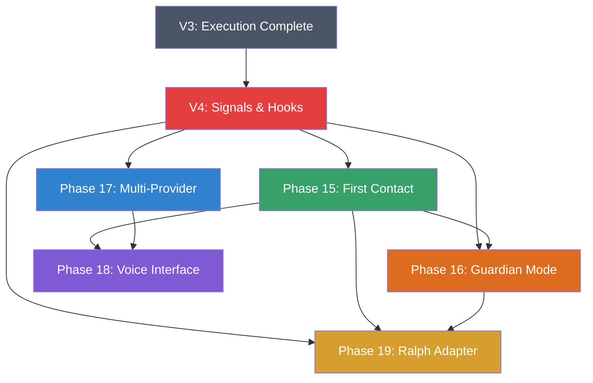

# SpaceCode V5 Implementation Checklist

**Status**: Draft
**Baseline**: V4 complete (Phases 10–13 — Signals, Hooks, Prompt Architecture, Cross-Sector, Orchestration + Telemetry; Phase 12 Mermaid optional)
**Theme**: The Living Station — onboarding, proactive intelligence, multi-provider AI, and voice
**Core Insight**: V4 wired the nervous system (EventBus, Hooks, Telemetry). V5 brings it to life with a named Station AI that guides, guards, speaks, and adapts.

### Station AI: CC-1 (CAPCOM)

> **CC-1** — *CAPCOM-1*, named after NASA Mission Control's **Capsule Communicator**: the only person authorized to speak directly to the astronauts. Every other specialist (FIDO, EECOM, GNC, SURGEON) routes through CAPCOM. CC-1 is the single voice between the developer and all specialist agents.

**Personality:**
- First-person introduction: *"I am CC-1, your CAPCOM — the station AI, your second in command."*
- Tone: professional, helpful, mildly warm — NASA flight controller, not sci-fi robot
- Refers to the project as "the mission" and the developer as "Commander" (or user-chosen callsign)
- Uses station terminology naturally: sectors, signals, telemetry, readiness

**Where CC-1 appears:**
| Location | Role |
|----------|------|
| First Contact (onboarding) | Guides new project setup, asks questions, fills station readiness |
| Station tab header | Status line: "CC-1: All systems nominal" or "CC-1: 2 items need attention" |
| Chat (when no persona selected) | Default conversational AI — routes to specialists when needed |
| Guardian alerts | Proactive notifications about project health |
| Voice interface | CC-1's voice is the station voice |

### CC-1 Identity Integration

> CC-1 must be wired into the existing persona system, not float outside it.

**Type system:**
- [ ] Add `'cc1'` to `AgentId` union in `src/agents/types.ts`
- [ ] Add CC-1 to `AgentDefinition` in `src/agents/definitions.ts` — icon: `📡`, color: station blue
- [ ] Create `src/personas/prompts/cc1.system.md` — CC-1's system prompt (CAPCOM personality, callsign interpolation, station terminology, routing awareness)

**Default persona:**
- [ ] Update `PERSONA_MAP` in `src/webview/panel/state.ts`:
  - `chat: 'cc1'` (was `'lead-engineer'`) — CC-1 is the default voice
  - All other tab mappings remain (station→qa-engineer, dashboard:docs→technical-writer, etc.)
- [ ] When user has no manual override and no tab-specific persona → CC-1 answers

**CC-1 → Specialist Routing:**
CC-1 must recognize when a question needs a specialist and hand off transparently.

| User intent | CC-1 routes to | How detected |
|-------------|---------------|-------------|
| "Fix this bug", code questions | Lead Engineer | Code keywords, file refs, error stack traces |
| "Why is this test failing" | QA Engineer | Test/debug/quality keywords |
| "Update the GDD", doc questions | Technical Writer | Doc type keywords, `/docs` commands |
| "Check the schema", DB questions | Database Engineer | SQL/schema/migration keywords |
| "Make this look better", UI/art | Art Director | Design/visual/art keywords |
| General chat, project questions | CC-1 (self) | No specialist match — CC-1 handles directly |

- [ ] Create `src/station/CC1Router.ts` — keyword-based intent classifier
- [ ] On routing: CC-1 says "Routing to {specialist}..." and switches persona context
- [ ] After specialist response: option to return to CC-1 ("Back to CAPCOM")
- [ ] Routing is a suggestion, not forced — user can override anytime
- [ ] CC-1 handles meta-questions about the project, readiness, setup, station status itself

**Navigation command:**
- [ ] Add `/first-contact` to `BUILTIN_NAV_COMMANDS` in `src/webview/panel/state.ts`

### Naming Convention (inherited from V4)

> UI/docs use station metaphor. Code keeps standard technical names.

| Concept | Code name (internal) | UI / Doc term |
|---------|---------------------|---------------|
| Station AI personality | `StationAI`, `CC1Engine` | **CC-1** / **CAPCOM** |
| Onboarding flow | `OnboardingWizard` | **First Contact** |
| Enhanced proactive engine | `GuardianEngine` | **Guardian Mode** |
| AI provider layer | `ProviderManager` | **Multi-Provider** |
| Voice system | `VoiceEngine` | **Voice Interface** |
| Ralph adapter | `RalphRunner`, `RalphSession` | **Ralph** |

---

## How to Use This Document

1. Pick a task from the checklist below
2. Mark it as `[~]` (in progress)
3. Implement, test in Extension Development Host
4. Mark as `[x]` when complete and working
5. Commit changes

**Legend:**
- `[ ]` Not started
- `[~]` In progress
- `[x]` Complete
- `[!]` Blocked / Issues

---

## V4 Prerequisites

> V5 phases build on V4 infrastructure. These must be working:

- [ ] Phase 10: EventBus, Hook Pipeline & Prompt Architecture (Signals, Hooks & Prompt) — core communication + prompt augmentation (includes former Phase 14)
- [ ] Phase 13: Orchestration Tab + Telemetry — signal flow visualization, tab consolidation (Telemetry fully replaced old Flow panel)

---

## Existing Code Baseline

> V5 extends existing infrastructure. These files already exist and must NOT be recreated from scratch — extend or refactor them.

### AI Providers (Phase 17 baseline)

| File | What exists | V5 action |
|------|------------|-----------|
| `src/mastercode_port/providers/base.ts` | `AIProvider` interface, `AIMessage`, `AIResponse`, `PRICING` table, `calculateCost()` | Extend interface to add `'gemini'` to provider union, add `getModels()`, `validateKey()`, `isAvailable()` |
| `src/mastercode_port/providers/claude.ts` | Full Claude provider with streaming, cost tracking | Refactor to implement extended interface |
| `src/mastercode_port/providers/gpt.ts` | Full GPT provider with streaming, cost tracking | Refactor to implement extended interface |
| `src/mastercode_port/providers/claudeCli.ts` | CLI-based Claude fallback provider | Keep as alternative transport |
| `src/mastercode_port/providers/gptCli.ts` | CLI-based GPT fallback provider | Keep as alternative transport |
| `src/mastercode_port/orchestrator/conversation.ts` | `ConversationOrchestrator` (EventEmitter), multi-turn, compaction | Wire to `ProviderManager.route()` |

### Voice System (Phase 18 baseline)

| File | What exists | V5 action |
|------|------------|-----------|
| `src/mastercode_port/services/voiceService.ts` | `VoiceService` class — STT (Whisper local + Vosk), TTS (Piper), model download, progress tracking | Extend with cloud providers (Whisper API, OpenAI TTS), add persona voice mapping |
| `src/mastercode_port/ui/handlers/voice.ts` | Voice message handlers for webview | Extend with new message types |
| `src/mastercode_port/ui/impl/voiceImpl.ts` | Voice implementation bridge | Extend |
| `src/webview/panel/features/voice.ts` | Voice panel UI in webview | Extend with push-to-talk, TTS controls |

### Persona System (Phase 15–16 baseline)

| File | What exists | V5 action |
|------|------------|-----------|
| `src/agents/types.ts` | `AgentId` type (6 personas), `AgentDefinition`, `SkillDefinition` | Add `'cc1'` to `AgentId` union |
| `src/personas/PromptLoader.ts` | Prompt loading + cache + delegated role loading | Add CC-1 prompt loading |
| `src/personas/prompts/*.system.md` | 6 base + 6 delegated role prompts (12 total) | Add `cc1.system.md` |
| `src/webview/panel/state.ts` | `PERSONA_MAP`, `TAB_SKILL_MAP`, `BUILTIN_NAV_COMMANDS` | Add CC-1 default, `/first-contact` command |
| `src/engineer/EngineerEngine.ts` | 6 rule triggers, scoring, persistence | Wire Guardian triggers as additional source |

### Sound System (separate from Voice)

| File | What exists | V5 action |
|------|------------|-----------|
| `src/mastercode_port/services/soundService.ts` | Notification sounds (aiComplete, buildFail, etc.) — **broken in dev host (CF-1)** | Fix in V3 CF-1, not V5. Voice (Phase 18) is TTS/STT, NOT notification sounds. |

---

## Phase 15: First Contact (Onboarding Wizard)
> CC-1's introduction sequence — project setup, user preferences, station readiness
> **Dependency**: Phase 10 (signals for component communication)
> **Triggers**: New workspace with no `.spacecode/` directory, or manual via command palette

### 15.0 Concept

```
┌──────────────────────────────────────────────────────────────────────────┐
│                                                                          │
│  ╔══════════════════════════════════════════════════════════════════╗    │
│  ║                                                                  ║    │
│  ║   Welcome, Commander.                                            ║    │
│  ║                                                                  ║    │
│  ║   I am CC-1, your CAPCOM — the station AI,                      ║    │
│  ║   your second in command.                                        ║    │
│  ║                                                                  ║    │
│  ║   Let's get the station online.                                  ║    │
│  ║                                                                  ║    │
│  ║   First, how should I address you?                               ║    │
│  ║                                                                  ║    │
│  ║   ┌──────────────────────────────────────┐                       ║    │
│  ║   │ Commander                        ▼   │                       ║    │
│  ║   └──────────────────────────────────────┘                       ║    │
│  ║   [Custom callsign...]                                           ║    │
│  ║                                                                  ║    │
│  ║                                           [Next →]               ║    │
│  ╚══════════════════════════════════════════════════════════════════╝    │
│                                                                          │
└──────────────────────────────────────────────────────────────────────────┘
```

**Flow overview:**

```
First Contact Sequence:
  Step 1: Greeting & callsign ──→ "How should I address you?"
  Step 2: Mission type         ──→ "What kind of project is this?"
  Step 3: Engine detection     ──→ Auto-detect Unity/Unreal/Godot/Web
  Step 4: Folder scan          ──→ Analyze folder structure, suggest sectors
  Step 5: Doc inventory        ──→ Check for GDD, SA, TDD, PRD
  Step 6: Provider setup       ──→ Configure AI providers (API keys)
  Step 7: MCP connections      ──→ Detect/configure MCP servers
  Step 8: Readiness report     ──→ Station Readiness Score + next steps
```

### 15.1 Trigger Detection

- [ ] On extension activation: check if `.spacecode/` directory exists
- [ ] If missing → show notification: "CC-1: New workspace detected. Run First Contact?"
- [ ] Command palette: `SpaceCode: Run First Contact`
- [ ] Manual trigger: CC-1 chat command `/first-contact`
- [ ] Re-run allowed (skips completed steps, updates readiness)
- [ ] Emit signal: `cc1:first-contact-started`

**Migration for existing V3/V4 projects:**
> Projects that already have `.spacecode/` (engineer-state.json, sector-config.json, etc.) but were created before CC-1 existed.

- [ ] On activation: if `.spacecode/` exists but `station.json` is missing → treat as existing project needing First Contact
- [ ] Show notification: "CC-1: I see you've been here a while, {Commander}. Let me get properly introduced. Run First Contact?"
- [ ] Pre-populate wizard from existing data:
  - Sectors → read from `sector-config.json`
  - Engine → detect as normal
  - Docs → scan as normal
  - Provider → read from existing VS Code settings
- [ ] Skip steps that are already satisfied (sectors configured, provider set up, etc.)
- [ ] Generate `station.json` with `firstContactCompleted: true` and calculated readiness

### 15.2 Step 1 — Greeting & Callsign

- [ ] Display CC-1 introduction message (see concept above)
- [ ] Callsign input: text field with preset dropdown (Commander, Captain, Chief, Boss)
- [ ] Custom callsign option (free text, max 20 chars)
- [ ] Store in `.spacecode/station.json` → `{ callsign: string }`
- [ ] CC-1 uses callsign throughout all future interactions

### 15.3 Step 2 — Mission Type

- [ ] "What kind of mission is this, {callsign}?"
- [ ] Options: Game (RPG, Platformer, Multiplayer, Mobile, VR/AR), Web App, API/Backend, Library, Other
- [ ] Selection determines: default sector templates, suggested docs, recommended MCP servers
- [ ] Store in `.spacecode/station.json` → `{ missionType: string, missionSubtype?: string }`

### 15.4 Step 3 — Engine Detection

- [ ] Auto-scan workspace for engine markers:

| Engine | Detection |
|--------|-----------|
| Unity | `ProjectSettings/ProjectSettings.asset`, `*.unity`, `Assets/` folder |
| Unreal | `*.uproject`, `Source/`, `Content/` |
| Godot | `project.godot` |
| Web/Node | `package.json`, `tsconfig.json` |
| .NET | `*.csproj`, `*.sln` |
| Python | `requirements.txt`, `pyproject.toml` |

- [ ] Display detected engine with version (parse from project files)
- [ ] For Unity: detect render pipeline (URP/HDRP/Built-in), color space (Linear/Gamma), scripting backend (IL2CPP/Mono)
- [ ] For Unity: warn if suboptimal settings (e.g., Gamma color space for 3D)
- [ ] If no engine detected → "Looks like a general project. That works too."
- [ ] Store in `.spacecode/station.json` → `{ engine: string, engineVersion?: string, engineSettings?: {} }`

### 15.5 Step 4 — Folder Structure Analysis

- [ ] Scan workspace folder structure (top 3 levels)
- [ ] Compare against engine best practices:

**Unity best practices:**
```
Assets/
├── _Project/         (or Assets/[GameName]/)
│   ├── Scripts/
│   │   ├── Core/
│   │   ├── UI/
│   │   ├── Gameplay/
│   │   └── ...
│   ├── Prefabs/
│   ├── Materials/
│   ├── Scenes/
│   ├── Art/
│   │   ├── Sprites/
│   │   ├── Models/
│   │   └── Animations/
│   ├── Audio/
│   ├── UI/
│   └── Resources/
├── Plugins/
└── ThirdParty/
```

- [ ] Flag deviations from best practices with severity (suggestion, not error)
- [ ] Suggest sector mapping based on detected folder structure
- [ ] If folders are minimal/empty: "Your project is fresh. I'll suggest a structure based on your mission type."
- [ ] Generate sector configuration from detected structure
- [ ] Store proposed sectors for Step 8 readiness
- [ ] Emit signal: `cc1:folder-scan-complete`

### 15.6 Step 5 — Document Inventory

- [ ] Scan for known document types:

| Document | Detection | Priority |
|----------|-----------|----------|
| GDD (Game Design Document) | `**/GDD*`, `**/game-design*` | Critical for games |
| SA (Software Architecture) | `**/SA*`, `**/architecture*` | Critical for all |
| TDD (Technical Design Doc) | `**/TDD*`, `**/technical-design*` | Important |
| PRD (Product Requirements) | `**/PRD*`, `**/requirements*` | Important |
| README | `README.md` | Basic |
| CHANGELOG | `CHANGELOG*` | Nice to have |
| API docs | `**/api-docs*`, `**/openapi*` | If API project |

- [ ] Display inventory: "Found: README.md, SA.md. Missing: GDD, TDD"
- [ ] For missing critical docs: "Your mission needs a GDD. Want me to help draft one?"
- [ ] Offer to create from template: `/docs create GDD` shortcut
- [ ] CC-1 emphasis: "Without a GDD and SA, I can help chat, but I can't truly guide the mission. Let's get these set up."
- [ ] Store doc inventory in `.spacecode/station.json` → `{ docs: { gdd: string|null, sa: string|null, ... } }`

### 15.7 Step 6 — Provider Setup

- [ ] "Now let's connect the station's AI systems."
- [ ] Check existing provider configuration (Claude, GPT keys)
- [ ] For each provider: status indicator (configured / not configured / invalid key)
- [ ] Quick setup: paste API key → validate → save
- [ ] Minimum: at least one provider must be configured
- [ ] Recommend Claude as primary, GPT as fallback (for Autopilot rate limit recovery)
- [ ] If Gemini available (V5 Phase 17): show as third option
- [ ] Store in VS Code settings (existing `spacecode.providers.*` settings)

### 15.8 Step 7 — MCP Connections

- [ ] Auto-detect running MCP servers (from `.vscode/mcp.json` or settings)
- [ ] Show connection status for each detected server
- [ ] Recommend MCP servers based on mission type:

| Mission Type | Recommended MCPs |
|-------------|-----------------|
| Unity Game | Coplay (Unity), Blender, Obsidian |
| Web App | Filesystem, GitHub, PostgreSQL |
| API/Backend | Postman, Docker, SSH Manager |
| All | GitHub, Filesystem |

- [ ] Quick-add: "Install recommended MCPs" button
- [ ] Test connections: ping each configured server
- [ ] Store connection status in `.spacecode/station.json`

### 15.9 Step 8 — Station Readiness Report

- [ ] Calculate **Station Readiness Score** (0–100%):

**Scoring formula:**

| Component | Weight | Criteria |
|-----------|--------|----------|
| AI Provider | 25% | At least one configured and valid |
| Project docs | 20% | GDD + SA present (10% each) |
| Folder structure | 15% | Follows engine best practices |
| Sectors configured | 15% | At least 3 sectors defined |
| MCP connections | 10% | At least one MCP server connected |
| Engine settings | 10% | Optimal settings detected (Unity: Linear, URP, IL2CPP) |
| README present | 5% | Basic project documentation |

- [ ] Display readiness as visual progress bar with breakdown:

```
┌─ STATION READINESS ──────────────────────────────────────────────┐
│                                                                    │
│  ████████████████████░░░░░░░░░░  68%                              │
│                                                                    │
│  ✓ AI Provider          25/25   Claude configured                 │
│  ✓ Folder Structure     12/15   Minor deviations noted            │
│  ◐ Project Docs         10/20   SA found, GDD missing             │
│  ✓ Sectors              15/15   5 sectors from folder scan        │
│  ○ MCP Connections       0/10   No MCP servers detected           │
│  ◐ Engine Settings       6/10   Gamma color space (should be Linear) │
│  ○ README                0/5    No README.md found                │
│                                                                    │
│  CC-1: "Station is operational at 68%, Commander.                  │
│         Priority: Create a GDD to improve mission guidance.        │
│         I'll remind you about the remaining items."                │
│                                                                    │
│  [Finish Setup]  [Create GDD Now]  [Skip for Now]                 │
│                                                                    │
└────────────────────────────────────────────────────────────────────┘
```

- [ ] Persist readiness score in `.spacecode/station.json`
- [ ] Show readiness in Station tab header (mini bar or percentage)
- [ ] Emit signal: `cc1:first-contact-complete`
- [ ] Guardian Mode (Phase 16) monitors readiness and nudges on missing items

### 15.10 Station Config File

All First Contact data stored in `.spacecode/station.json`:

```typescript
interface StationConfig {
  version: 1;
  callsign: string;                          // "Commander"
  missionType: string;                       // "game-rpg"
  engine: {
    name: string;                            // "unity"
    version?: string;                        // "2022.3.14f1"
    renderPipeline?: string;                 // "urp"
    colorSpace?: string;                     // "linear"
    scriptingBackend?: string;               // "il2cpp"
  };
  docs: {
    gdd: string | null;                      // path or null
    sa: string | null;
    tdd: string | null;
    prd: string | null;
    readme: string | null;
  };
  readiness: {
    score: number;                           // 0-100
    breakdown: Record<string, number>;       // component → score
    lastCalculated: string;                  // ISO date
  };
  firstContactCompleted: boolean;
  firstContactDate?: string;
}
```

- [ ] Create `src/station/StationConfig.ts` — read/write `.spacecode/station.json`
- [ ] Create `src/station/ReadinessCalculator.ts` — calculate readiness score
- [ ] Create `src/station/CC1Engine.ts` — CC-1 personality, greeting, status messages

### 15.11 First Contact UI

- [ ] Create `src/webview/panel/features/firstContact.ts` — wizard step renderer
- [ ] Create `src/mastercode_port/ui/handlers/firstContact.ts` — message handlers
- [ ] Wizard renders in the content area (right panel), chat shows CC-1 commentary
- [ ] Each step has: description, inputs, "Next" / "Skip" / "Back" buttons
- [ ] Progress indicator: step dots at top (1 ● ● ○ ○ ○ ○ ○ 8)
- [ ] Animations: each step slides in from right
- [ ] CC-1 chat messages appear alongside wizard steps (conversational feel)

### 15.12 Message Protocol

**Webview → Extension:**
```typescript
{ type: 'firstContactStart' }
{ type: 'firstContactStep', step: number, data: any }
{ type: 'firstContactSkip', step: number }
{ type: 'firstContactComplete' }
{ type: 'stationReadiness' }            // request current readiness
```

**Extension → Webview:**
```typescript
{ type: 'firstContactState', step: number, totalSteps: number, data: any }
{ type: 'firstContactScanResult', scanType: string, result: any }
{ type: 'stationReadinessResult', score: number, breakdown: {} }
{ type: 'cc1Message', text: string, priority: 'info' | 'warning' | 'critical' }
```

---

## Phase 16: Guardian Mode (Enhanced Station Engineer)
> CC-1 as proactive project guardian — enhanced triggers, folder monitoring, doc completeness
> **Dependency**: Phase 10 (signals), Phase 15 (station config), V3 Phase 1 (base Engineer)
> **Builds on**: V3 Station Engineer (6 rule-based triggers) → adds folder-aware, doc-aware, engine-aware triggers

### 16.0 Concept

V3 Station Engineer has 6 triggers (docs-stale, tests-failing, policy-changed, undocumented-files, sector-violation, orphan-files). Guardian Mode adds **project-level intelligence** — CC-1 doesn't just react to code changes, it monitors the mission's overall health.

```
V3 Engineer (reactive):
  "These files changed" → trigger rules → suggest

V5 Guardian (proactive):
  "The mission is drifting" → analyze holistically → guide

┌─ GUARDIAN MODE ───────────────────────────────────────────────────────┐
│                                                                        │
│  CC-1 continuously monitors:                                           │
│                                                                        │
│  📁 Folder Structure                                                   │
│     → New folder created outside convention → suggest correct location │
│     → File placed in wrong sector → warn and suggest move              │
│     → Deep nesting detected → suggest flattening                       │
│                                                                        │
│  📄 Document Completeness                                              │
│     → GDD missing → nag progressively (gentle → firm)                  │
│     → SA outdated (drift > 7 days) → suggest sync                     │
│     → New feature discussed in chat → "Should we update the GDD?"      │
│                                                                        │
│  ⚙️ Engine Health                                                      │
│     → Unity: deprecated API usage detected → suggest upgrade path      │
│     → Unity: build settings suboptimal → suggest changes               │
│     → Package updates available → notify                               │
│                                                                        │
│  📊 Mission Progress                                                   │
│     → Readiness score dropped → investigate why                        │
│     → Milestone date approaching → remind                              │
│     → No commits in 3+ days → "Everything ok, {callsign}?"            │
│                                                                        │
└────────────────────────────────────────────────────────────────────────┘
```

### 16.1 Folder Structure Guardian

- [ ] Create `src/guardian/FolderGuardian.ts` — file system watcher with convention rules
- [ ] Load engine-specific folder conventions from templates (Unity, Unreal, Godot, Web)
- [ ] On file/folder create: check against convention → emit `guardian:folder-deviation`
- [ ] Deviation types: `wrong-location`, `bad-naming`, `deep-nesting`, `outside-sector`
- [ ] Suggestion: "This script should be in `Assets/_Project/Scripts/UI/`, not `Assets/Scripts/`"
- [ ] Respect user overrides: if user dismisses convention for a path, remember it
- [ ] Store overrides in `.spacecode/guardian-overrides.json`

**Unity folder conventions:**

| Convention | Rule |
|------------|------|
| Scripts go in `Scripts/` | `*.cs` outside `Scripts/` or `Editor/` → warn |
| Prefabs go in `Prefabs/` | `*.prefab` outside `Prefabs/` → suggest |
| Materials go in `Materials/` | `*.mat` outside `Materials/` → suggest |
| Scenes go in `Scenes/` | `*.unity` outside `Scenes/` → suggest |
| No spaces in paths | Space in folder/file name → warn (Unity issue) |
| Max 4 levels deep | Nesting > 4 → suggest flatten |
| No special characters | `@`, `#`, `!` in names → warn |

### 16.2 Document Completeness Guardian

- [ ] Create `src/guardian/DocGuardian.ts` — monitors document inventory vs requirements
- [ ] Track which docs exist (from First Contact scan or re-scan)
- [ ] Progressive nagging for critical missing docs:

**Nag escalation (GDD example):**

| Trigger | Nag Level | Message |
|---------|-----------|---------|
| First Contact → GDD missing | Gentle | "When you're ready, a GDD will help me guide the mission better." |
| 3 days later, still missing | Moderate | "Hey {callsign}, without a GDD I'm flying blind on design decisions." |
| 7 days later, still missing | Firm | "Mission advisory: no GDD on file. I strongly recommend we draft one. `/docs create GDD`" |
| User starts feature discussion | Contextual | "Great idea. Before we build, should we capture this in a GDD?" |

- [ ] Track nag history to avoid repetition (max 1 nag per doc per 3 days)
- [ ] On doc created: celebration message + readiness score update
- [ ] On doc edited: check for staleness reset
- [ ] Detect doc-code drift: doc mentions module X, but module X has changed → suggest sync
- [ ] Subscribe to `chat:response-complete` — if AI discusses new features, check GDD coverage

### 16.3 Engine Health Guardian

- [ ] Create `src/guardian/EngineGuardian.ts` — engine-specific health checks
- [ ] Run on: extension activation, daily, manual trigger

**Unity health checks:**

| Check | How | Severity |
|-------|-----|----------|
| Color space | Parse `ProjectSettings.asset` | Warning if Gamma for 3D |
| Render pipeline | Detect URP/HDRP/Built-in | Info |
| Scripting backend | Check IL2CPP vs Mono | Warning if Mono for production |
| API compatibility | Check `.NET` level | Info |
| Deprecated APIs | Scan for obsolete Unity API calls | Warning |
| Package updates | Check `manifest.json` vs registry | Info |
| Build target | Check active build target | Info |
| Quality settings | Check shadow/LOD settings | Suggestion |

- [ ] Emit `guardian:engine-health` signal with check results
- [ ] Show in Station tab alongside existing Engineer suggestions
- [ ] CC-1 message: "Your Unity project is using Gamma color space. For 3D games, Linear gives more accurate lighting. Want me to explain the difference?"

### 16.4 Mission Progress Guardian

- [ ] Create `src/guardian/MissionGuardian.ts` — high-level project progress tracking
- [ ] Track: last commit date, readiness score trend, doc update frequency
- [ ] Inactivity detection: no commits in N days → friendly check-in
- [ ] Readiness regression: score dropped → investigate and report cause
- [ ] Milestone awareness: if project has milestones (from tickets/docs), track proximity
- [ ] Weekly summary (optional): "This week: 12 commits, readiness 68%→72%, 1 new doc created"

### 16.5 Guardian Integration with V3 Engineer

- [ ] Guardian triggers feed into existing `EngineerEngine.ts` suggestion pipeline
- [ ] Guardian suggestions have `source: 'guardian'` (alongside `source: 'rule'` and `source: 'ai'`)
- [ ] Guardian suggestions use same scoring formula: `(Risk×3) + (Impact×2) + (Urgency×2) - Effort`
- [ ] Guardian suggestions appear in Station Engineer panel with CC-1 icon
- [ ] Dismissal/deferral follows same 24h cooldown logic

### 16.6 CC-1 Status Messages

CC-1 generates contextual status messages for the Station tab header:

| Condition | Status Message |
|-----------|---------------|
| All good | "All systems nominal, {callsign}." |
| Minor items | "2 items need attention." |
| Missing GDD | "Mission needs a GDD to operate at full capacity." |
| Build failed | "Build failure detected — QA Engineer is standing by." |
| High readiness | "Station at 95% readiness. Well done, {callsign}." |
| Inactivity | "Standing by, {callsign}. Ready when you are." |

- [ ] Create `src/station/CC1Messages.ts` — message templates with callsign interpolation
- [ ] Status message updates on: signal events, timer (every 5 min), tab focus
- [ ] Show in Station tab header strip (replacing or alongside Engineer status)

### 16.7 Guardian Signal Catalog

| Signal | Payload | Trigger |
|--------|---------|---------|
| `guardian:folder-deviation` | `{ path, convention, severity }` | File created in wrong location |
| `guardian:doc-missing` | `{ docType, nagLevel, daysMissing }` | Critical doc not found |
| `guardian:doc-stale` | `{ docPath, daysSinceUpdate, driftType }` | Doc hasn't been updated |
| `guardian:engine-health` | `{ checks: HealthCheck[] }` | Engine health scan complete |
| `guardian:readiness-changed` | `{ oldScore, newScore, reason }` | Readiness score changed |
| `guardian:inactivity` | `{ daysSinceCommit }` | No commits detected |
| `cc1:status-changed` | `{ message, priority }` | CC-1 status message updated |

### 16.8 Guardian ↔ V4 Hook Pipeline Integration
> Guardian must register hooks via V4 Phase 10 Hook Pipeline to inject context into AI prompts

- [ ] Create `src/hooks/builtins/guardianContextHook.ts` — `beforeAiCall` hook
- [ ] Hook injects into system prompt: active Guardian warnings, readiness summary, CC-1 status
- [ ] Priority: lower than sector-rules and persona-skills, higher than engineer-context
- [ ] Token budget: max 200 tokens for guardian context (summary only, not full details)
- [ ] Hook only fires when Guardian has active warnings (no-op when "all systems nominal")
- [ ] Register in `src/hooks/HookRegistry.ts` alongside other built-in hooks

**Prompt injection format:**
```
[STATION STATUS — CC-1]
Readiness: 68% | Missing: GDD | 2 folder deviations pending
Active warnings: Gamma color space detected (should be Linear for 3D)
```

### 16.9 Guardian ↔ V4 Signal Subscriptions
> Guardian components subscribe to V4 EventBus signals for reactive monitoring

**FolderGuardian subscribes to:**
| V4 Signal | Guardian Action |
|-----------|----------------|
| `sector:file-changed` | Check if file is in correct folder per convention |
| `sector:entered` | Update current sector context for convention rules |

**DocGuardian subscribes to:**
| V4 Signal | Guardian Action |
|-----------|----------------|
| `chat:response-complete` | Scan response for new feature discussion → nag about GDD |
| `doc:drift-detected` | Escalate drift warning, update readiness score |
| `doc:updated` | Reset staleness timer, recalculate readiness |

**EngineGuardian subscribes to:**
| V4 Signal | Guardian Action |
|-----------|----------------|
| `build:result` | On failure → engine health suggestion; on success → update readiness |
| `test:result` | Feed test pass/fail rate into readiness score |

**MissionGuardian subscribes to:**
| V4 Signal | Guardian Action |
|-----------|----------------|
| `guardian:readiness-changed` | Update CC-1 status message |
| `engineer:suggestion-new` | Track suggestion volume for weekly summary |
| `autopilot:complete` | Include in weekly progress summary |

- [ ] Register all Guardian signal subscriptions in `src/hooks/HookRegistry.ts` or `src/guardian/GuardianRegistry.ts`
- [ ] Subscriptions registered at extension activation, after EventBus is ready
- [ ] Each Guardian component self-registers via `eventBus.subscribe()`

---

## Phase 17: Multi-Provider Architecture
> Abstract AI layer supporting Claude + GPT + Gemini with intelligent routing
> **Dependency**: Phase 10 (signals for provider events), V3 Autopilot (agent fallback)
> **Builds on**: V3 has Claude + GPT with manual switching. V5 adds Gemini and automatic routing.

### 17.0 Concept

```
┌─ PROVIDER ARCHITECTURE ──────────────────────────────────────────────┐
│                                                                        │
│  Application Layer (Chat, Autopilot, Engineer, Skills)                 │
│         │                                                              │
│         ▼                                                              │
│  ┌─ PROVIDER MANAGER ──────────────────────────────────────────────┐  │
│  │                                                                  │  │
│  │  Route request → select provider → execute → return response     │  │
│  │                                                                  │  │
│  │  Routing strategies:                                             │  │
│  │    • Manual:    user picks provider per-chat                     │  │
│  │    • Primary:   always use preferred, fallback on error          │  │
│  │    • Round-robin: distribute across providers                    │  │
│  │    • Smart:     route by task type (code→Claude, docs→GPT, etc)  │  │
│  │                                                                  │  │
│  └──┬──────────────────┬──────────────────┬────────────────────────┘  │
│     │                  │                  │                            │
│     ▼                  ▼                  ▼                            │
│  ┌────────┐     ┌────────┐        ┌────────┐                         │
│  │ Claude │     │  GPT   │        │ Gemini │                         │
│  │Provider│     │Provider│        │Provider│                         │
│  └────────┘     └────────┘        └────────┘                         │
│                                                                        │
│  Each provider implements: AIProvider interface                        │
│  • chat(messages, options) → response                                 │
│  • stream(messages, options) → AsyncIterable<chunk>                   │
│  • getModels() → ModelInfo[]                                          │
│  • validateKey() → boolean                                            │
│  • getUsage() → UsageStats                                            │
│                                                                        │
└────────────────────────────────────────────────────────────────────────┘
```

### Provider Capability Matrix

> ProviderManager must know each provider's capabilities to make routing decisions. This matrix is the source of truth.

| Capability | Claude | GPT | Gemini |
|-----------|--------|-----|--------|
| **Streaming** | Yes | Yes | Yes |
| **Tool/Function calling** | Yes | Yes | Yes |
| **Vision (image input)** | Yes (Opus/Sonnet) | Yes (GPT-4o) | Yes (all models) |
| **Long context (>128K)** | Yes (200K) | Yes (128K) | Yes (1M+) |
| **JSON mode** | Yes | Yes | Yes |
| **System prompt** | Yes | Yes | Yes |
| **Max output tokens** | 8,192 | 16,384 | 8,192 |
| **Code generation quality** | Excellent | Very Good | Good |
| **Cost (per 1M input tokens)** | $3–$15 | $2.50–$10 | $0.075–$1.25 |

> Checked at runtime via `provider.getCapabilities()`. SmartRouter (17.5) uses it for task-type routing.
> Update this matrix when new models ship or capabilities change.

### 17.1 AIProvider Interface

> **Existing code**: `src/mastercode_port/providers/base.ts` already defines `AIProvider`, `AIMessage`, `AIResponse`, and `PRICING`. The provider union is currently `'claude' | 'gpt'`. Phase 17 extends this to support Gemini and adds routing.

- [ ] Extend `AIProvider` interface in `src/mastercode_port/providers/base.ts`:
  - Widen provider type: `'claude' | 'gpt'` → `'claude' | 'gpt' | 'gemini'`
  - Add `getModels()`, `validateKey()`, `isAvailable()` methods
  - Add `id`, `displayName`, `icon` readonly properties
  - Add Gemini pricing to `PRICING` table
- [ ] Keep backward compatibility: existing `sendMessage()` / `streamMessage()` signatures unchanged
- [ ] Create `src/providers/ProviderManager.ts` — new file, wraps existing providers with routing

```typescript
interface AIProvider {
  readonly id: ProviderId;                    // 'claude' | 'gpt' | 'gemini'
  readonly displayName: string;
  readonly icon: string;

  chat(messages: Message[], options: ChatOptions): Promise<ChatResponse>;
  stream(messages: Message[], options: ChatOptions): AsyncIterable<StreamChunk>;
  getModels(): Promise<ModelInfo[]>;
  validateKey(apiKey: string): Promise<boolean>;
  getUsage(): Promise<UsageStats>;
  isAvailable(): boolean;
}

interface ChatOptions {
  model?: string;
  maxTokens?: number;
  temperature?: number;
  systemPrompt?: string;
  tools?: ToolDefinition[];
  signal?: AbortSignal;
}

interface ChatResponse {
  content: string;
  model: string;
  provider: ProviderId;
  usage: { inputTokens: number; outputTokens: number };
  finishReason: 'stop' | 'max_tokens' | 'tool_use';
  toolCalls?: ToolCall[];
}
```

- [ ] Create `src/providers/ClaudeProvider.ts` — refactor existing Anthropic integration
- [ ] Create `src/providers/GPTProvider.ts` — refactor existing OpenAI integration
- [ ] Create `src/providers/GeminiProvider.ts` — new Google AI integration

### 17.2 Gemini Provider

- [ ] Install `@google/generative-ai` SDK
- [ ] Implement `GeminiProvider` with all AIProvider methods
- [ ] Model support: Gemini 2.0 Flash, Gemini 2.0 Pro, Gemini 1.5 Pro
- [ ] Map Gemini-specific options (safety settings, generation config)
- [ ] Handle Gemini tool/function calling format
- [ ] Streaming support via Gemini stream API
- [ ] API key validation
- [ ] Error mapping: Gemini errors → standard SpaceCode error format

**Gemini-specific features:**
- [ ] Long context window support (1M+ tokens for Gemini 1.5 Pro)
- [ ] Multimodal support (image input for Art Director persona)
- [ ] Grounding with Google Search (optional, for research tasks)

### 17.3 Provider Manager

- [ ] Create `src/providers/ProviderManager.ts` — central routing layer
- [ ] Register providers at activation
- [ ] Routing strategies:

| Strategy | Behavior | Use Case |
|----------|----------|----------|
| `manual` | User selects provider per-chat | Default — full control |
| `primary-fallback` | Use primary, fall to next on error | Autopilot resilience |
| `round-robin` | Alternate between configured providers | Cost distribution |
| `smart` | Route by task type and provider strengths | Advanced (Phase 17.5) |

- [ ] Implement `route(request, strategy)` → selects provider based on strategy
- [ ] Implement fallback chain: if provider A fails → try B → try C → error
- [ ] Rate limit detection per provider (reuse V3 `RateLimitDetector`)
- [ ] Circuit breaker: if provider fails 3x in 5 minutes → temporarily skip
- [ ] Emit signals: `provider:request-start`, `provider:request-complete`, `provider:fallback-triggered`, `provider:rate-limited`

### 17.4 Provider UI

- [ ] Provider selector in chat header: `[Claude ▼]` dropdown showing all configured providers
- [ ] Provider status indicators: `● Claude (ready)  ● GPT (ready)  ○ Gemini (no key)`
- [ ] Provider setup in Dashboard → Settings:
  - API key input per provider
  - Model selection per provider
  - Default provider selection
  - Routing strategy selection
- [ ] Usage stats per provider (tokens used, requests made, errors)
- [ ] In Telemetry panel: provider routing visualized as signal flow

### 17.5 Smart Routing (Optional)

Task-type-based routing — uses provider strengths:

| Task Type | Recommended Provider | Reason |
|-----------|---------------------|--------|
| Code generation | Claude | Strong code capabilities |
| Documentation | Any | All providers handle well |
| Long context analysis | Gemini | 1M+ token window |
| Image analysis | Gemini / Claude | Multimodal support |
| Quick chat | GPT / Gemini Flash | Lower cost, fast response |
| Security analysis | Claude | Strong reasoning |

- [ ] Create `src/providers/SmartRouter.ts` — task classification + provider recommendation
- [ ] Classify task from system prompt + user message (keyword matching, not AI — fast)
- [ ] Configurable routing rules in `.spacecode/provider-routing.json`
- [ ] User can override per-request

### 17.6 Refactor Existing Code

> Key: MCP tool calls (Coplay, Blender, etc.) do NOT route through ProviderManager — MCP is a separate transport. Only AI chat/completion calls go through the provider layer.

- [ ] Refactor `src/mastercode_port/orchestrator/conversation.ts` — replace direct provider instantiation with `ProviderManager.route()`
- [ ] Refactor `src/mastercode_port/providers/claude.ts` — implement extended `AIProvider` interface
- [ ] Refactor `src/mastercode_port/providers/gpt.ts` — implement extended `AIProvider` interface
- [ ] Refactor `src/autopilot/ErrorStrategy.ts` — replace hardcoded Claude→GPT fallback with `ProviderManager` fallback chain
- [ ] Remove hardcoded provider selection logic scattered across codebase
- [ ] All AI calls go through `ProviderManager.route()`
- [ ] Backward compatible: existing `spacecode.claudeApiKey` / `spacecode.gptApiKey` settings still work
- [ ] New setting: `spacecode.geminiApiKey` for Gemini provider

### 17.7 Message Protocol

**Webview → Extension:**
```typescript
{ type: 'providerSetKey', provider: ProviderId, apiKey: string }
{ type: 'providerSetDefault', provider: ProviderId }
{ type: 'providerSetModel', provider: ProviderId, model: string }
{ type: 'providerSetStrategy', strategy: RoutingStrategy }
{ type: 'providerGetStatus' }
{ type: 'providerGetUsage' }
```

**Extension → Webview:**
```typescript
{ type: 'providerStatus', providers: ProviderStatus[] }
{ type: 'providerUsage', usage: Record<ProviderId, UsageStats> }
{ type: 'providerChanged', activeProvider: ProviderId, reason: string }
```

---

## Phase 18: Voice Interface
> TTS/STT for hands-free coding — CC-1 speaks, developer speaks back
> **Dependency**: Phase 17 (provider abstraction), Phase 15 (CC-1 personality)
> **Note**: This is a progressive enhancement — SpaceCode works fully without voice

### 18.0 Concept

```
┌─ VOICE INTERFACE ─────────────────────────────────────────────────────┐
│                                                                        │
│  Developer speaks → STT → text input → AI → text response → TTS       │
│                                                                        │
│  ┌──────────┐    ┌──────────┐    ┌──────────┐    ┌──────────┐        │
│  │ 🎙️ Mic   │───▶│ STT      │───▶│ Chat     │───▶│ TTS      │───▶🔊  │
│  │          │    │ Engine   │    │ Pipeline │    │ Engine   │        │
│  └──────────┘    └──────────┘    └──────────┘    └──────────┘        │
│                                                                        │
│  Input modes:                                                          │
│  • Push-to-talk (hold key to speak)                                    │
│  • Toggle (click to start/stop)                                        │
│  • Continuous (always listening, wake word activation)                  │
│                                                                        │
│  Voice persona:                                                        │
│  • CC-1 has a consistent voice (TTS voice ID)                          │
│  • Each persona can optionally have a distinct voice                   │
│  • Voice settings: speed, pitch, volume                                │
│                                                                        │
└────────────────────────────────────────────────────────────────────────┘
```

### 18.1 STT (Speech-to-Text) Engine

> **Existing code**: `src/mastercode_port/services/voiceService.ts` already implements local Whisper (tiny/base/small/medium models via HuggingFace) and Vosk STT with model download, progress tracking, and settings persistence. Phase 18 extends this with cloud STT providers and adds the push-to-talk UX layer on top.

- [ ] Extend `VoiceService` in `src/mastercode_port/services/voiceService.ts`:
  - Add `'whisper-api'` STT provider (cloud, via OpenAI API — complements existing local Whisper)
  - Add `'web-speech'` STT provider (browser Web Speech API — zero download)
  - Keep existing local Whisper/Vosk as offline providers
- [ ] Create `src/voice/STTEngine.ts` — high-level STT abstraction that wraps `VoiceService` + cloud providers

**Provider options:**

| Provider | Cost | Quality | Latency | Offline |
|----------|------|---------|---------|---------|
| OpenAI Whisper API | $0.006/min | Excellent | ~1-2s | No |
| Google Cloud Speech | Free tier | Excellent | ~0.5s | No |
| Web Speech API | Free | Good | Real-time | Browser-dependent |
| Whisper.cpp (local) | Free | Excellent | ~2-3s | Yes |

- [ ] Primary: OpenAI Whisper API (highest quality, already have OpenAI key)
- [ ] Fallback: Web Speech API (free, built into Chromium/webview)
- [ ] Future: local Whisper.cpp for offline use
- [ ] Implement `startListening()` → captures audio → sends to STT
- [ ] Implement `stopListening()` → finalizes transcription
- [ ] Return transcript as text → feeds into chat input
- [ ] Language detection (auto or user-configured)
- [ ] Noise cancellation hint: show audio level indicator

### 18.2 TTS (Text-to-Speech) Engine

> **Existing code**: `VoiceService` already has Piper TTS with local model download. Phase 18 adds cloud TTS providers (OpenAI TTS, ElevenLabs) for higher quality voices, and adds persona-aware voice selection.

- [ ] Extend `VoiceService` — add `'openai-tts'` and `'web-speech'` TTS providers alongside existing Piper
- [ ] Create `src/voice/TTSEngine.ts` — high-level TTS abstraction with voice persona routing

**Provider options:**

| Provider | Cost | Quality | Voices | Latency |
|----------|------|---------|--------|---------|
| OpenAI TTS | $0.015/1K chars | Excellent | 6 | ~1s |
| ElevenLabs | Free tier | Superior | Many | ~1s |
| Google Cloud TTS | Free tier | Excellent | 300+ | ~0.5s |
| Web Speech API | Free | Decent | OS-dependent | Instant |

- [ ] Primary: OpenAI TTS (natural voices, already have key)
- [ ] Fallback: Web Speech API (free, instant)
- [ ] Implement `speak(text, voiceId, options)` → plays audio
- [ ] Implement `stop()` → interrupt current speech
- [ ] Queue management: if new response arrives while speaking, queue or interrupt
- [ ] SSML support for emphasis and pacing (where provider supports it)
- [ ] Streaming TTS: start speaking as response streams in (partial sentences)

### 18.3 Voice Persona Mapping

Each persona can have a distinct TTS voice:

| Persona | Voice Character | OpenAI Voice |
|---------|----------------|-------------|
| CC-1 (default) | Calm, authoritative, clear | `nova` or `onyx` |
| Lead Engineer | Confident, technical | `echo` |
| QA Engineer | Precise, methodical | `fable` |
| Technical Writer | Warm, articulate | `shimmer` |
| Database Engineer | Analytical, steady | `alloy` |
| Art Director | Expressive, creative | `nova` |

- [ ] Create `src/voice/VoicePersona.ts` — persona → voice mapping
- [ ] Store voice preferences in settings
- [ ] Voice changes when persona switches (smooth transition)
- [ ] CC-1 always uses CC-1 voice regardless of active persona for Guardian alerts

### 18.4 Push-to-Talk UI

- [ ] Microphone button in chat input area: 🎙️
- [ ] Hold to talk (press and hold mic button or keyboard shortcut)
- [ ] Visual feedback: pulsing ring around mic button while recording
- [ ] Audio level indicator (bouncing bars)
- [ ] Transcription preview: show text as it's transcribed (interim results)
- [ ] Release to send (auto-submits transcribed text)
- [ ] Toggle mode option: click once to start, click again to stop
- [ ] Keyboard shortcut: configurable (default: `Ctrl+Shift+V`)
- [ ] Status indicator: 🎙️ (ready) → 🔴 (recording) → ⏳ (transcribing)

### 18.5 TTS Controls

- [ ] Speaker button next to AI responses: 🔊 (click to read aloud)
- [ ] Auto-read option: automatically speak AI responses (toggle in settings)
- [ ] Skip button: stop current speech
- [ ] Speed control: 0.5x → 1x → 1.5x → 2x
- [ ] Volume control (separate from system volume)
- [ ] "Read selection" — select text in response, click speaker to read just that part

### 18.6 Voice Settings

```typescript
interface VoiceSettings {
  enabled: boolean;
  stt: {
    provider: 'whisper-api' | 'web-speech' | 'whisper-local';
    language: string;           // 'auto' | 'en' | 'it' | etc.
    inputMode: 'push-to-talk' | 'toggle' | 'continuous';
    hotkey: string;             // 'ctrl+shift+v'
  };
  tts: {
    provider: 'openai-tts' | 'elevenlabs' | 'web-speech';
    autoRead: boolean;          // auto-read AI responses
    speed: number;              // 0.5 - 2.0
    volume: number;             // 0.0 - 1.0
  };
  personaVoices: Record<string, string>;  // persona → voice ID
}
```

- [ ] Add Voice section to Dashboard → Settings
- [ ] Provider selection with API key status
- [ ] Voice preview: "Test voice" button plays sample
- [ ] Per-persona voice assignment dropdown
- [ ] Input mode selection (push-to-talk / toggle / continuous)
- [ ] Hotkey configuration

### 18.7 Voice Integration with Chat

- [ ] Voice input feeds into same chat pipeline as typed input
- [ ] Voice responses go through same Hook Pipeline (`afterAiResponse`)
- [ ] Voice mode indicator in chat header: 🎙️ ON / OFF
- [ ] Mixed mode: type AND speak in same conversation
- [ ] Voice commands: "Hey CC-1, switch to Lead Engineer" (wake word + command)
- [ ] Conversation context preserved between voice and text inputs

### 18.8 Signal Integration

| Signal | Payload | Trigger |
|--------|---------|---------|
| `voice:stt-started` | `{ mode }` | User started speaking |
| `voice:stt-result` | `{ transcript, confidence }` | Speech transcribed |
| `voice:tts-started` | `{ text, voice }` | TTS playback started |
| `voice:tts-complete` | `{ duration }` | TTS playback finished |
| `voice:error` | `{ engine, error }` | STT/TTS error |

### 18.9 Message Protocol

**Webview → Extension:**
```typescript
{ type: 'voiceStartListening', mode: 'push-to-talk' | 'toggle' }
{ type: 'voiceStopListening' }
{ type: 'voiceSpeak', text: string, persona?: string }
{ type: 'voiceStop' }
{ type: 'voiceSetSettings', settings: Partial<VoiceSettings> }
```

**Extension → Webview:**
```typescript
{ type: 'voiceTranscript', text: string, interim: boolean }
{ type: 'voiceSpeaking', active: boolean }
{ type: 'voiceLevel', level: number }       // 0-1, for audio visualization
{ type: 'voiceError', engine: string, message: string }
```

---

## Phase 19: Ralph Integration (External Tool Adapter)
> SpaceCode launches Ralph, tracks progress, ingests outputs — without embedding Ralph into core workflows
> **Dependency**: Phase 10 (signals for progress events). Benefits from Phase 15 (CC-1 can suggest running Ralph), Phase 17 (provider abstraction for model selection)
> **Integration mode**: External CLI adapter — SpaceCode calls Ralph, Ralph owns its execution loop
> **Why not embed**: Keeps V5 modular. Ralph has its own autonomy loop; rewriting it into Autopilot would duplicate logic. Adapter pattern = clean boundary.

### 19.0 Concept

```
┌─ RALPH INTEGRATION ──────────────────────────────────────────────────┐
│                                                                        │
│  SpaceCode (orchestrator)          Ralph (autonomous agent)            │
│                                                                        │
│  ┌────────────────┐   spawn CLI   ┌────────────────┐                  │
│  │ RalphRunner.ts │──────────────▶│ ralph cli      │                  │
│  │                │               │                │                  │
│  │ • start/stop   │   watch files │ • parse PRD    │                  │
│  │ • stream logs  │◀──────────────│ • plan steps   │                  │
│  │ • parse output │   progress.txt│ • execute code │                  │
│  │ • emit signals │               │ • run tests    │                  │
│  └────────┬───────┘               └────────────────┘                  │
│           │                                                            │
│           ▼                                                            │
│  ┌─────────────────────────────────────────────────────────────────┐  │
│  │ Output Ingestion                                                 │  │
│  │  • Artifacts → file tree update                                  │  │
│  │  • Test results → readiness score                                │  │
│  │  • Unresolved steps → ticket creation                            │  │
│  │  • Summary → chat (Engineer persona)                             │  │
│  │  • Changelog entry (if tests passed)                             │  │
│  └─────────────────────────────────────────────────────────────────┘  │
│                                                                        │
└────────────────────────────────────────────────────────────────────────┘
```

### 19.1 UX Entry Points

**Where Ralph appears:**

| Location | Action |
|----------|--------|
| Station → Ops (or Dashboard → Tools) | "Run Ralph on PRD" button |
| Chat | `/ralph` command — attach PRD and launch |
| CC-1 Guardian (Phase 16) | CC-1 suggests: "PRD updated — want me to run Ralph on the changes?" |

**UI controls:**
- [ ] PRD file picker (select `.md` or `.txt` file from workspace)
- [ ] Working directory selector (defaults to workspace root)
- [ ] Model selector (optional — uses default provider from Phase 17)
- [ ] "Dry run" toggle (plan only, no execution)
- [ ] "Run Ralph" button

### 19.2 Backend Adapter

- [ ] Create `src/tools/RalphRunner.ts` — CLI adapter service:

```typescript
interface RalphSession {
  id: string;
  prdPath: string;
  workingDir: string;
  status: 'idle' | 'running' | 'paused' | 'failed' | 'complete';
  startedAt: string;
  progress: number;                    // 0-100
  currentStep?: string;
  totalSteps?: number;
  completedSteps?: number;
  artifacts: string[];                 // files changed/created
  testResults?: { passed: number; failed: number; skipped: number };
  failureReason?: string;
}
```

- [ ] `ralphStart(prdPath, options)` — spawn Ralph CLI process, return session ID
- [ ] `ralphStop(sessionId)` — kill Ralph process gracefully
- [ ] `ralphPause(sessionId)` — pause execution (if Ralph supports it)
- [ ] `ralphStatus(sessionId)` — return current `RalphSession` state
- [ ] `ralphLogs(sessionId)` — stream stdout/stderr to webview
- [ ] Watch `progress.txt` (or Ralph's output format) for step updates
- [ ] Parse Ralph output into structured `RalphSession` fields
- [ ] Persist session to `.spacecode/ralph-session.json` for crash recovery
- [ ] On extension activation: check for interrupted Ralph session → offer resume

### 19.3 Ralph Control Panel

```
┌─ RALPH ────────────────────────────────────────────────────────────────┐
│                                                                         │
│  Status: ● Running          PRD: docs/PRD.md                           │
│  Step: 4/12 — "Implementing PlayerInventory system"                     │
│                                                                         │
│  ████████████████░░░░░░░░░░  33%                                       │
│                                                                         │
│  ┌─ LOG STREAM ────────────────────────────────────────────────────┐   │
│  │  [19:04:12] Parsing PRD sections...                              │   │
│  │  [19:04:15] Generated 12 implementation steps                    │   │
│  │  [19:04:18] Step 1: Create PlayerInventory.cs ✓                  │   │
│  │  [19:04:45] Step 2: Create InventorySlot.cs ✓                    │   │
│  │  [19:04:52] Step 3: Create InventoryUI.uxml ✓                    │   │
│  │  [19:05:10] Step 4: Implementing PlayerInventory system...       │   │
│  └──────────────────────────────────────────────────────────────────┘   │
│                                                                         │
│  Artifacts (3 files created):                                          │
│  • Assets/Scripts/Inventory/PlayerInventory.cs                          │
│  • Assets/Scripts/Inventory/InventorySlot.cs                            │
│  • Assets/UI/Inventory/InventoryUI.uxml                                 │
│                                                                         │
│  [⏸ Pause]  [⏹ Stop]  [📋 View Full Log]                              │
│                                                                         │
└─────────────────────────────────────────────────────────────────────────┘
```

- [ ] Create `src/webview/panel/features/ralph.ts` — control panel renderer
- [ ] Status indicator: idle / running / paused / failed / complete
- [ ] Active PRD display with link to file
- [ ] Step counter + progress bar
- [ ] Scrolling log stream (stdout from Ralph)
- [ ] Artifact list (files changed/created, clickable to open)
- [ ] Pause / Stop / View Log buttons
- [ ] On completion: summary card with test results + next actions

### 19.4 Message Protocol

**Webview → Extension:**
```typescript
{ type: 'ralphStart', prdPath: string, workingDir: string, model?: string, dryRun?: boolean }
{ type: 'ralphStop', sessionId: string }
{ type: 'ralphPause', sessionId: string }
{ type: 'ralphResume', sessionId: string }
{ type: 'ralphStatus', sessionId?: string }
{ type: 'ralphLogs', sessionId: string }
```

**Extension → Webview:**
```typescript
{ type: 'ralphSessionState', session: RalphSession }
{ type: 'ralphLog', sessionId: string, line: string, timestamp: string }
{ type: 'ralphProgress', sessionId: string, step: number, total: number, description: string }
{ type: 'ralphComplete', sessionId: string, summary: RalphSummary }
{ type: 'ralphError', sessionId: string, error: string }
```

### 19.5 Output Ingestion

> After Ralph completes, SpaceCode ingests its outputs into the station's systems.

- [ ] **Artifacts → file tree**: refresh VS Code explorer, highlight new/changed files
- [ ] **Test results → readiness**: if Ralph ran tests, feed into Guardian readiness score via `test:result` signal
- [ ] **Unresolved steps → tickets**: any steps Ralph couldn't complete → create tickets in Dashboard → Tickets
- [ ] **Summary → chat**: post completion summary to chat via Engineer persona
- [ ] **Changelog → docs**: if all tests passed, append entry to CHANGELOG.md (with user confirmation)

```typescript
interface RalphSummary {
  stepsCompleted: number;
  stepsFailed: number;
  stepsSkipped: number;
  filesCreated: string[];
  filesModified: string[];
  testsRun: boolean;
  testsPassed?: number;
  testsFailed?: number;
  unresolvedSteps: { step: number; description: string; reason: string }[];
}
```

### 19.6 Guardrails

> **Boundary rule**: Ralph never edits workspace files directly. Ralph runs in its own staging directory; SpaceCode ingests outputs only after review. When autoexecute is ON and tests pass, ingestion is automatic. Otherwise, all outputs require explicit user approval.

- [ ] Ralph writes to a staging directory (`.spacecode/ralph-out/`), NOT directly to workspace
- [ ] If autoexecute is **OFF** → outputs staged, user reviews diff per file before accepting
- [ ] If autoexecute is **ON** AND tests pass → outputs auto-applied to workspace
- [ ] If autoexecute is **ON** BUT tests fail → outputs staged, not applied, CC-1 alerts: "Ralph finished but {N} tests failed. Review staged files."
- [ ] If tests fail → block auto-merge, create ticket per failing test
- [ ] Sector gate: if cross-sector workflow active (V4 Phase 11), Ralph respects sector boundaries
- [ ] Ralph session timeout: if no progress for 10 minutes → auto-pause, notify user
- [ ] Max concurrent: only one Ralph session at a time

### 19.7 Signal Integration

| Signal | Payload | Direction |
|--------|---------|-----------|
| `ralph:started` | `{ sessionId, prdPath }` | Emitted on launch |
| `ralph:progress` | `{ sessionId, step, total, description }` | Emitted per step |
| `ralph:complete` | `{ sessionId, summary: RalphSummary }` | Emitted on finish |
| `ralph:failed` | `{ sessionId, error, step }` | Emitted on failure |
| `ralph:artifact` | `{ sessionId, filePath, action: 'created' \| 'modified' }` | Per file change |

**Guardian integration:**
- DocGuardian subscribes to `ralph:complete` → check if PRD is now out of sync with generated code
- MissionGuardian subscribes to `ralph:complete` → update weekly summary
- CC-1 subscribes to `ralph:failed` → "Ralph hit a wall on step {N}, {callsign}. Want me to investigate?"

### 19.8 CC-1 + Guardian Triggers

- [ ] Guardian detects PRD file changed → CC-1 suggests: "PRD updated. Run Ralph to implement the changes?"
- [ ] Guardian detects new PRD file created → CC-1 suggests: "New PRD detected. Want Ralph to plan the implementation?"
- [ ] After Ralph completes → CC-1 summary: "Ralph completed 10/12 steps. 2 need manual attention. Tests: 8 passed, 1 failed."
- [ ] `/ralph` chat command triggers Ralph with PRD selection dialog

---

## V3 Carry-Forward Ownership

> Items from V3 that remain unaddressed. Assigning ownership to V5 or explicitly deferring.

### Owned by V5

| V3 Item | V5 Owner | Notes |
|---------|----------|-------|
| CF-4: Doc Sync AI (propose/approve/update) | Phase 16.2 DocGuardian | Guardian detects drift + nags. AI-driven propose/approve/update cycle added here. |
| Phase 6.3: Build Pipeline Integration | Phase 16.9 EngineGuardian | Guardian subscribes to `build:result` signal, auto-suggests on failure |
| Phase 1.5: AI-Driven Suggestions | Phase 16 Guardian + CC-1 Router | Guardian provides project-level AI analysis; CC-1 routing gives intelligent delegation |

### CF-4 Extension: Doc Sync AI (owned by Phase 16.2)

- [ ] When DocGuardian detects stale doc → AI proposes specific updates (not just "update the doc")
- [ ] Technical Writer persona generates proposed diff/edits
- [ ] Show proposed changes in chat: "SA section 3.2 mentions `PlayerController.Move()` but that method was renamed to `PlayerController.HandleMovement()`. Here's the updated section:"
- [ ] User approves/rejects/edits → doc updated automatically
- [ ] Emit signal: `doc:sync-proposed`, `doc:sync-approved`, `doc:sync-applied`

### Deferred to V6+ (Backlog)

| V3 Item | Reason | Notes |
|---------|--------|-------|
| CF-1: Sound System debugging | Low priority, not blocking | Notification sounds (afplay) broken in dev host. Fix when convenient. |
| CF-3: Testing & Quality Gaps | Large scope | Diagnostics tab, test runner, dependency CVE UI, quality tab. Needs its own phase. |
| CF-5: MCP Live Connection Features | Waiting on MCP ecosystem | Per-server details, tool routing. Depends on stable MCP standards. |
| CF-6: Domain-specific agents | Future expansion | ShaderSmith, Spine2DExpert, DatabaseGuard, Librarian. Add as community needs arise. |
| CF-6: YAML skill file system | Future expansion | Parse front-matter, validate schema, CRUD UI. Good V6 candidate. |
| CF-7: Mode System (Learn/Maintenance) | Low priority | Explorer integration. Revisit when usage patterns are clearer. |

---

## Tab Structure Note (V4 Alignment)

> V4 Phase 13 renames "Agents" → "Orchestration" and absorbs Skills as a sub-tab.
> Post-V4 tab bar: `[Station] [Orchestration] [Dashboard]` + persistent Chat
> Orchestration sub-tabs: `[Agents] [Skills] [Hooks] [Telemetry]`
> **Flow panel fully removed** — Telemetry in Orchestration tab replaces it entirely.
> Station right-panel modes post-V4: `[station] [control] [planning]` (no more `flow`)
>
> V5 does NOT change the tab structure. All V5 features integrate into existing locations:
> - CC-1 / First Contact → Station tab (content area) + Chat panel
> - Guardian → Station tab (Engineer panel)
> - Provider settings → Dashboard → Settings
> - Voice controls → Chat panel (mic button + speaker buttons)
> - Ralph → Station → Ops sub-tab (or Dashboard → Tools) + `/ralph` chat command

---

## Appendix A: File Map

| Component | File(s) | New / Extend |
|-----------|---------|-------------|
| CC-1 System Prompt | `src/personas/prompts/cc1.system.md` | **New** |
| CC-1 Router | `src/station/CC1Router.ts` | **New** |
| CC-1 Engine | `src/station/CC1Engine.ts` | **New** |
| CC-1 Messages | `src/station/CC1Messages.ts` | **New** |
| Station Config | `src/station/StationConfig.ts` | **New** |
| Readiness Calculator | `src/station/ReadinessCalculator.ts` | **New** |
| First Contact UI | `src/webview/panel/features/firstContact.ts` | **New** |
| First Contact Handler | `src/mastercode_port/ui/handlers/firstContact.ts` | **New** |
| Folder Guardian | `src/guardian/FolderGuardian.ts` | **New** |
| Doc Guardian | `src/guardian/DocGuardian.ts` | **New** |
| Engine Guardian | `src/guardian/EngineGuardian.ts` | **New** |
| Mission Guardian | `src/guardian/MissionGuardian.ts` | **New** |
| Guardian Context Hook | `src/hooks/builtins/guardianContextHook.ts` | **New** |
| Guardian Registry | `src/guardian/GuardianRegistry.ts` | **New** |
| AI Provider Interface | `src/mastercode_port/providers/base.ts` | **Extend** |
| Claude Provider | `src/mastercode_port/providers/claude.ts` | **Extend** |
| GPT Provider | `src/mastercode_port/providers/gpt.ts` | **Extend** |
| Gemini Provider | `src/providers/GeminiProvider.ts` | **New** |
| Provider Manager | `src/providers/ProviderManager.ts` | **New** |
| Smart Router | `src/providers/SmartRouter.ts` | **New** |
| Voice Service | `src/mastercode_port/services/voiceService.ts` | **Extend** |
| STT Engine | `src/voice/STTEngine.ts` | **New** (wraps VoiceService) |
| TTS Engine | `src/voice/TTSEngine.ts` | **New** (wraps VoiceService) |
| Voice Persona | `src/voice/VoicePersona.ts` | **New** |
| Voice Handlers | `src/mastercode_port/ui/handlers/voice.ts` | **Extend** |
| Voice UI | `src/webview/panel/features/voice.ts` | **Extend** |
| Agent Types | `src/agents/types.ts` | **Extend** (`'cc1'` added) |
| Persona Map | `src/webview/panel/state.ts` | **Extend** (CC-1 default, `/first-contact`) |
| Engineer Engine | `src/engineer/EngineerEngine.ts` | **Extend** (Guardian source) |
| Prompt Loader | `src/personas/PromptLoader.ts` | **Extend** (CC-1 loading) |
| Ralph Runner | `src/tools/RalphRunner.ts` | **New** |
| Ralph Handler | `src/mastercode_port/ui/handlers/ralph.ts` | **New** |
| Ralph UI | `src/webview/panel/features/ralph.ts` | **New** |
| Station Config File | `.spacecode/station.json` | **New** |
| Guardian Overrides | `.spacecode/guardian-overrides.json` | **New** |
| Provider Routing | `.spacecode/provider-routing.json` | **New** |
| Ralph Session | `.spacecode/ralph-session.json` | **New** |

## Appendix B: Signal Reference (V5 additions)

**V5 emits:**
```
cc1:first-contact-started      cc1:first-contact-complete
cc1:status-changed             cc1:folder-scan-complete

guardian:folder-deviation      guardian:doc-missing
guardian:doc-stale              guardian:engine-health
guardian:readiness-changed      guardian:inactivity

doc:sync-proposed              doc:sync-approved
doc:sync-applied

provider:request-start          provider:request-complete
provider:fallback-triggered     provider:rate-limited
provider:changed

voice:stt-started              voice:stt-result
voice:tts-started              voice:tts-complete
voice:error

ralph:started                  ralph:progress
ralph:complete                 ralph:failed
ralph:artifact
```

**V5 subscribes to (from V4 Signal Catalog):**
```
sector:file-changed            → FolderGuardian, EngineGuardian
sector:entered                 → FolderGuardian
build:result                   → EngineGuardian, MissionGuardian
test:result                    → MissionGuardian (readiness)
chat:response-complete         → DocGuardian (feature discussion → GDD nag)
doc:drift-detected             → DocGuardian (escalate)
doc:updated                    → DocGuardian (reset staleness)
engineer:suggestion-new        → MissionGuardian (weekly summary)
autopilot:complete             → MissionGuardian (weekly summary)
```

## Appendix C: Phase Dependency Graph



**Critical path**: V4 (Signals & Hooks) → Phase 15 (First Contact) → Phase 16 (Guardian) + Phase 18 (Voice)

**Recommended execution order**:
1. Phase 15 (First Contact) — CC-1 introduction, station config, readiness
2. Phase 16 (Guardian Mode) — proactive monitoring (builds on First Contact data)
3. Phase 17 (Multi-Provider) — Gemini + provider abstraction (independent of 15/16)
4. Phase 18 (Voice) — TTS/STT (needs provider layer + CC-1 personality)
5. Phase 19 (Ralph) — can start after Phase 15+16, benefits from 17 (provider selection)

---

## Global Phase Map (V3–V5)

| Version | Phases | Theme |
|---------|--------|-------|
| V3 | 0–9 + CF | Foundation — layout, engineer, security, autopilot, game UI, comms, ops, markdown |
| V4 | 10–14 | Nervous System — signals, hooks, telemetry, prompt architecture |
| V5 | 15–19 | The Living Station — CC-1, guardian, multi-provider, voice, Ralph |

---

*Last updated: 2026-02-05*
